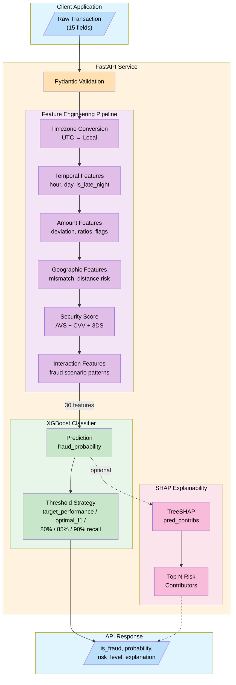
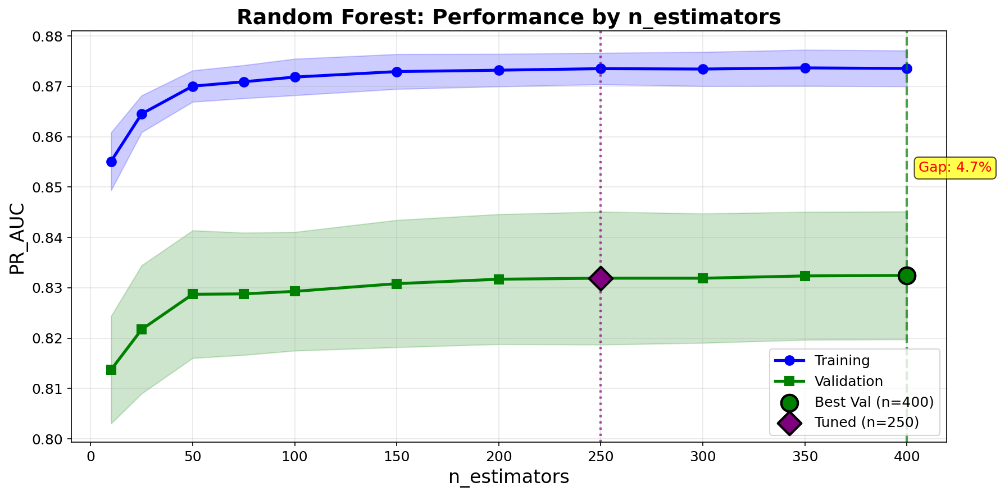
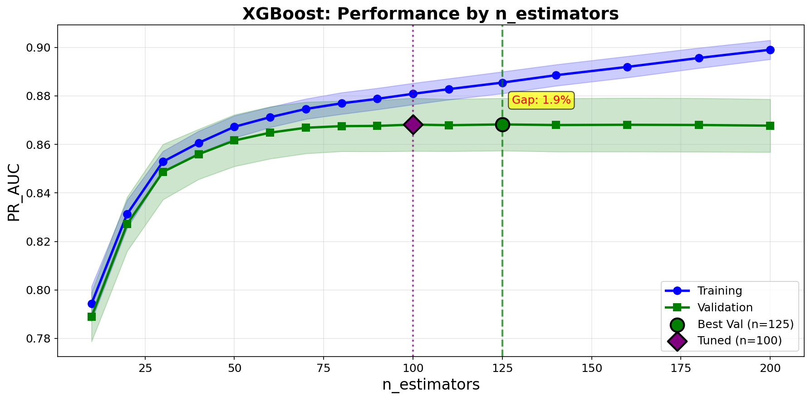
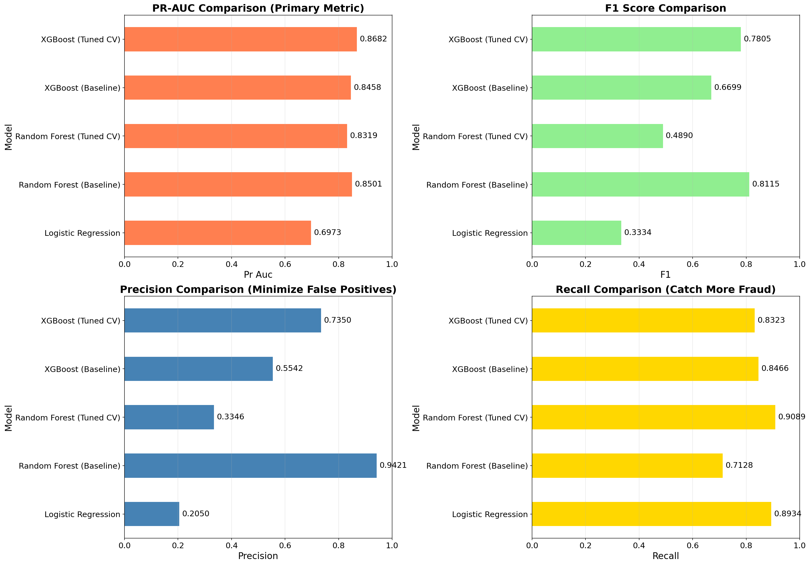
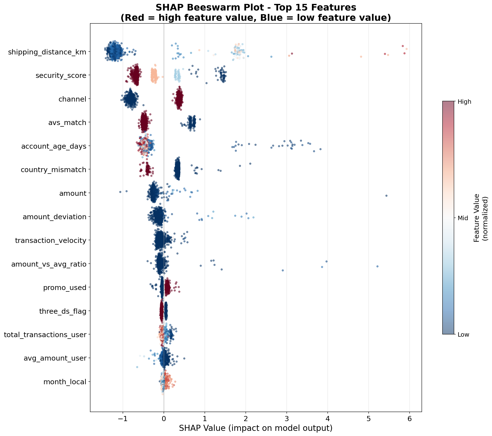
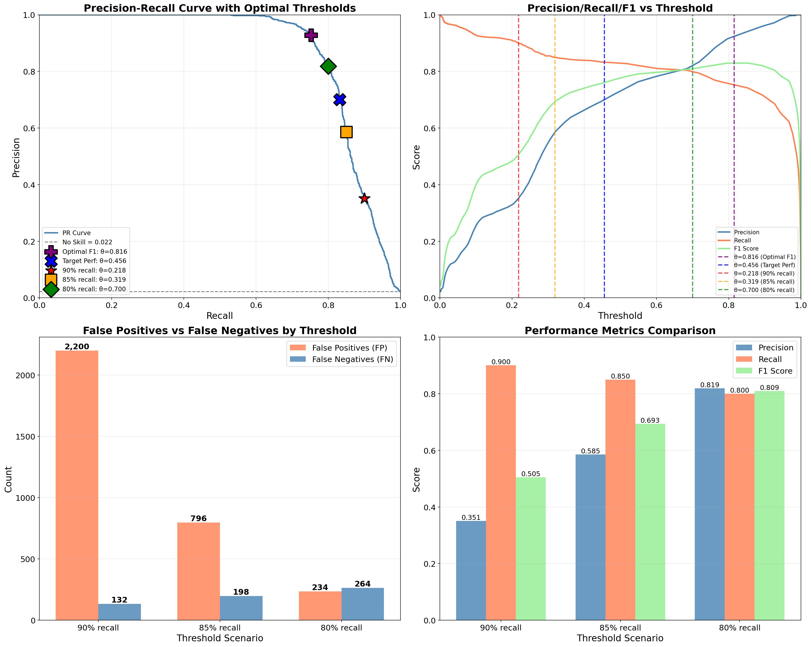

# E-Commerce Fraud Detection

A machine learning project to detect fraudulent e-commerce transactions using classification models. The goal is to develop, optimize, and deploy a production-ready fraud detection system.

## Table of Contents

### Introduction
- [Project Overview](#project-overview)
- [About This Project](#about-this-project)
- [Dataset](#dataset)
- [Technology Stack](#technology-stack)

### Setup
- [Getting Started](#getting-started)
  - [Prerequisites](#prerequisites)
  - [Installation](#installation)
- [Project Structure](#project-structure)

### Development
- [Development Guide](#development-guide)
  - [Virtual Environment & Package Management](#virtual-environment-and-package-management)
  - [Exploratory Data Analysis](#exploratory-data-analysis)
  - [Feature Engineering Development](#feature-engineering-development)
  - [Model Training & Hyperparameter Tuning](#model-training--hyperparameter-tuning)

### Production
- [Production Pipeline](#production-pipeline)
  - [Feature Engineering Pipeline](#feature-engineering-pipeline)
  - [Feature Engineering Summary](#feature-engineering-summary)
  - [Model Training Script](#model-training-script)
  - [Model Performance](#model-performance)

### Deployment
- [Deployment](#deployment)
  - [Deployment Plan](#deployment-plan)
  - [API Deployment Options](#api-deployment-options)
    - [Option 1: Local Development](#option-1-local-development-fastapi--uvicorn-)
    - [Option 2: Docker](#option-2-docker-deployment-recommended-for-production-)
    - [Option 3: Cloud](#option-3-cloud-deployment-)
  - [API Usage Examples](#api-usage-examples)

### Testing & Performance
- [Testing](#testing)
- [Performance Benchmarking](#performance-benchmarking)

### Additional Information
- [Contributing](#contributing)
- [License](#license)
- [Acknowledgments](#acknowledgments)
- [Contact](#contact)
- [Resources](#resources)

---

## Project Overview

This project builds and deploys a classification model to identify fraudulent e-commerce transactions in real-time. Using a realistic synthetic dataset that models actual fraud patterns observed in 2024, the system aims to help e-commerce platforms prevent fraudulent activity while minimizing false positives that could impact legitimate customers.

**Project Goal**: Deploy an optimally trained classification model capable of identifying fraudulent transactions with high precision and recall, packaged as a REST API service.

### System Architecture



**Key Components:**
- **Feature Engineering**: Transforms 15 raw fields into 30 engineered features using production `FraudFeatureTransformer`
- **XGBoost Model**: Tuned classifier with PR-AUC 0.87, optimized for fraud detection
- **Threshold Strategies**: 5 configurable precision-recall trade-offs (target_performance recommended, optimal_f1, plus 80%, 85%, 90% recall targets)
- **SHAP Explainability**: Optional per-prediction explanations showing top risk-increasing features

### Example Fraud Patterns Detected
- Card testing with small-value purchases (e.g., $1 transactions at midnight)
- Geographic anomalies (e.g., gaming accessories shipped 5,000 km away)
- Promo code abuse from newly created accounts
- Mismatched verification signals (AVS, CVV, 3D Secure)

## About This Project

This project is being developed as part of the [DataTalksClub Machine Learning Zoomcamp](https://github.com/DataTalksClub/machine-learning-zoomcamp), a comprehensive course covering:
- Machine learning fundamentals
- Model training and evaluation
- Deployment and MLOps practices
- Production-ready ML systems

## Dataset

**Source**: [Kaggle - E-Commerce Fraud Detection Dataset](https://www.kaggle.com/datasets/umuttuygurr/e-commerce-fraud-detection-dataset)

### Dataset Characteristics
- **Size**: 299,695 transactions
- **Features**: 17 columns (user behavior, transaction details, security flags, geographic data)
- **Target**: `is_fraud` (binary classification)
- **Class Distribution**:
  - Normal transactions: 97.8%
  - Fraudulent transactions: 2.2%
  - **Imbalance ratio**: 44:1 (significant class imbalance)
- **Quality**: No missing values, no duplicates

### Key Features
- **User Behavior**: Account age, transaction history, average spend patterns
- **Transaction Details**: Amount, timestamp, merchant category, channel (web/app)
- **Geographic Data**: User country, card-issuing bank country, shipping distance
- **Security Signals**: AVS match, CVV result, 3D Secure flag, promo code usage

## Technology Stack

### Data Science & ML
- **Python**: 3.12+
- **Data Processing**: pandas, numpy
- **Visualization**: matplotlib, seaborn
- **ML Models**: scikit-learn, xgboost
- **Explainability**: shap (SHAP values for model interpretation)
- **Statistics**: statsmodels
- **Timezone Handling**: pytz (UTC to local time conversion)
- **Testing**: pytest (unit and integration tests)
- **Performance Testing**: locust (load testing), requests (HTTP benchmarks)
- **Notebook Environment**: Jupyter

### Deployment
- **Feature Engineering**: Production-ready sklearn-compatible transformer
- **API Framework**: FastAPI
- **ASGI Server**: Uvicorn
- **Containerization**: Docker
- **Package Management**: uv (fast Python package installer)

## Project Structure

```
.
├── train.py                            # Model training script
├── predict.py                          # FastAPI prediction service
├── notebooks/                          # Jupyter notebooks
│   ├── fd1_EDA_FE.ipynb                # Notebook 1: EDA & feature engineering
│   ├── fd2_model_selection_tuning.ipynb # Notebook 2: Model selection & tuning
│   └── fd3_model_evaluation_deployment.ipynb # Notebook 3: Evaluation & deployment
├── docs/                               # Supplementary documentation
│   ├── CHANGES_SUMMARY.md              # Summary of major changes
│   ├── GCP_DEPLOYMENT.md               # Google Cloud Run deployment guide
│   └── REFACTORING_SUMMARY.md          # Code refactoring documentation
├── analysis/                           # Analysis scripts
│   └── bias_variance_analysis.py       # Bias-variance diagnostics script
├── benchmarks/                         # Performance testing suite
│   ├── benchmark.py                    # Custom benchmarking script
│   ├── locustfile.py                   # Load testing configuration (Locust)
│   └── results/                        # Generated outputs (gitignored)
├── data/                               # Dataset directory (gitignored)
│   └── transactions.csv                # Raw transaction data from Kaggle
├── src/                                # Source code modules
│   ├── deployment/                     # Production code for model deployment
│   │   ├── config/                     # Configuration management
│   │   │   ├── data_config.py          # Data loading configuration
│   │   │   ├── model_config.py         # Hyperparameters & feature lists
│   │   │   ├── training_config.py      # CV strategy & thresholds
│   │   │   └── __init__.py             # Package exports
│   │   ├── data/                       # Data loading utilities
│   │   │   ├── loader.py               # load_and_split_data()
│   │   │   └── __init__.py             # Package exports
│   │   ├── preprocessing/              # Feature engineering pipeline
│   │   │   ├── config.py               # FeatureConfig dataclass
│   │   │   ├── features.py             # Feature engineering functions
│   │   │   ├── transformer.py          # FraudFeatureTransformer (sklearn-compatible)
│   │   │   ├── pipelines.py            # PreprocessingPipelineFactory
│   │   │   └── __init__.py             # Package exports
│   │   ├── evaluation/                 # Model evaluation utilities
│   │   │   ├── metrics.py              # evaluate_model()
│   │   │   ├── thresholds.py           # optimize_thresholds()
│   │   │   └── __init__.py             # Package exports
│   │   └── explainability/             # SHAP-based prediction explanations
│   │       ├── __init__.py             # Package exports
│   │       ├── shap_explainer.py       # FraudExplainer class
│   │       └── feature_descriptions.py # Human-readable feature names
│   ├── fd1_nb/                         # Notebook 1 utility functions (EDA & FE)
│   │   ├── __init__.py                 # Package exports (21 functions)
│   │   ├── data_utils.py               # Data loading, splitting, analysis
│   │   ├── eda_utils.py                # EDA functions (VIF, correlations, MI)
│   │   └── feature_engineering.py      # Feature engineering utilities
│   ├── fd2_nb/                         # Notebook 2 utility functions (Model Selection & Tuning)
│   │   ├── __init__.py                 # Package exports (14 functions)
│   │   ├── model_comparison.py         # Model comparison and visualization
│   │   ├── hyperparameter_tuning.py    # GridSearchCV/RandomizedSearchCV utilities
│   │   ├── cv_analysis.py              # CV results analysis and train-val gap detection
│   │   └── bias_variance.py            # Bias-variance diagnostics
│   └── fd3_nb/                         # Notebook 3 utility functions (Evaluation & Deployment)
│       ├── __init__.py                 # Package exports (18 functions)
│       ├── evaluation.py               # Model evaluation and performance comparison
│       ├── visualization.py            # ROC/PR curves, SHAP beeswarm plots
│       ├── threshold_optimization.py   # Threshold optimization strategies
│       ├── feature_importance.py       # Feature importance (XGBoost gain + SHAP)
│       └── deployment.py               # Deployment artifact generation
├── tests/                              # Test suite (425 passing tests)
│   ├── conftest.py                     # Shared pytest fixtures
│   ├── test_api.py                     # API integration tests (33 tests)
│   ├── test_config/                    # Shared config tests (44 tests)
│   ├── test_data/                      # Data loading tests (12 tests)
│   ├── test_eda/                       # EDA utility tests (68 tests)
│   ├── test_evaluation/                # Evaluation tests (26 tests)
│   ├── test_explainability/            # Explainability tests (9 tests)
│   ├── test_fd2_nb/                    # Notebook 2 utility tests (63 tests)
│   ├── test_fd3_nb/                    # Notebook 3 utility tests (83 tests)
│   └── test_preprocessing/             # Preprocessing tests (61 tests)
├── models/                             # Model artifacts (tracked in git)
│   ├── xgb_fraud_detector.joblib       # Trained XGBoost model (~156KB)
│   ├── transformer_config.json         # Feature engineering configuration
│   ├── model_metadata.json             # Model version, hyperparameters, metrics
│   ├── threshold_config.json           # Optimized decision thresholds
│   ├── feature_lists.json              # Feature names and categorization
│   ├── best_params.json                # Optimal hyperparameters (from fd2)
│   ├── validation_metrics.json         # Validation metrics (from fd2)
│   └── logs/                           # Hyperparameter tuning logs (gitignored)
├── images/                             # Screenshots and documentation images
├── Dockerfile                          # Container image definition
├── docker-compose.yml                  # Local Docker deployment
├── requirements.txt                    # Python dependencies (pip format)
├── pyproject.toml                      # Python dependencies (uv format)
├── uv.lock                             # Locked dependency versions
├── .gitignore                          # Git exclusions
├── claude.md                           # Project context for Claude Code
└── README.md                           # This file
```

## Getting Started

### Prerequisites

1. **Python 3.12+**
   ```bash
   python --version  # Verify installation
   ```

2. **uv Package Manager**
   ```bash
   # Install uv if not already installed
   curl -LsSf https://astral.sh/uv/install.sh | sh
   ```

3. **Kaggle API Credentials (Optional)**
  - Create an account at [kaggle.com](https://www.kaggle.com)
  - Go to Account settings → API → Create New Token
  - Place the downloaded `kaggle.json` in `~/.kaggle/`
  - Set permissions: `chmod 600 ~/.kaggle/kaggle.json`

### Installation

1. **Clone the repository**
   ```bash
   git clone https://github.com/frederick-douglas-pearce/e-commerce-fraud-detection.git
   cd e-commerce-fraud-detection
   ```

2. **Install dependencies**
   ```bash
   uv sync
   ```

3. **Launch Jupyter Notebook**
   ```bash
   uv run --with jupyter jupyter lab
   ```

4. **Run the notebooks in sequence** (in `notebooks/` folder)
  - **Step 1**: Open `notebooks/fd1_EDA_FE.ipynb` for EDA and feature engineering
    - Run cells sequentially
    - Dataset will auto-download on first run if not present
  - **Step 2**: Open `notebooks/fd2_model_selection_tuning.ipynb` for model selection and tuning
    - Run cells sequentially
    - Generates `models/best_params.json` and `models/validation_metrics.json`
  - **Step 3**: Open `notebooks/fd3_model_evaluation_deployment.ipynb` for final evaluation
    - Run cells sequentially
    - Loads parameters from step 2
    - Generates deployment artifacts in `models/`

## Development Guide

This section covers the development process for exploring the data, engineering features, and training models using Jupyter notebooks.

### Virtual Environment and Package Management

```bash
# Add new dependencies
uv add <package-name>

# Update dependencies
uv sync

# Run Jupyter notebook
uv run --with jupyter jupyter lab
```

### Notebook Workflow

The project uses a modular three-notebook workflow for clear separation of concerns:

**Notebook 1: EDA & Feature Engineering** (`notebooks/fd1_EDA_FE.ipynb`)

- **Data Loading & EDA**: Automated Kaggle download, train/val/test splits (60/20/20), class imbalance analysis (44:1)
- **Feature Engineering**: 32 features created across temporal, amount, behavior, geographic, security, and interaction categories
- **Feature Selection**: 30 features selected, removing redundant/low-signal features
- **Output**: `transformer_config.json`, `feature_lists.json` for production deployment

**Notebook 2: Model Selection & Hyperparameter Tuning** (`notebooks/fd2_model_selection_tuning.ipynb`)

- **Data Loading**: Applies `FraudFeatureTransformer` to generate 30 features from raw data
- **Model Training**: Logistic Regression, Random Forest, XGBoost baselines with GridSearchCV tuning
- **Bias-Variance Analysis**: Train-validation gap diagnostics to minimize overfitting

<p align="center">
  
  
</p>

*Bias-variance analysis comparing Random Forest (left) and XGBoost (right). XGBoost achieves significantly higher validation performance (PR-AUC: 0.868 vs 0.832) while exhibiting substantially less overfitting (train-validation gap: 1.5% vs 4.7%). The tuned XGBoost model (n_estimators=100) was selected where validation performance plateaus while maintaining a minimal train-validation gap.*

- **Model Selection**: XGBoost (Tuned) selected as best performer (PR-AUC: 0.868, Precision: 73.5%, Recall: 83.2%)
- **Output**: `xgb_fraud_detector.joblib`, `best_params.json`, `validation_metrics.json`

<p align="center">
  
</p>

*XGBoost (Tuned) achieves the best PR-AUC (0.868) while maintaining strong precision (73.5%) and recall (83.2%), significantly outperforming baselines and providing better precision-recall balance than Random Forest alternatives.*

**Notebook 3: Final Evaluation & Deployment** (`notebooks/fd3_model_evaluation_deployment.ipynb`)

- **Test Set Evaluation**: Unbiased evaluation on held-out test set (59,939 samples)
- **Feature Importance**: SHAP-based analysis with beeswarm plots

<p align="center">
  
</p>

*SHAP beeswarm plot showing how feature values impact fraud predictions. Red points (high values) on the right increase fraud risk; blue points (low values) on the left decrease it. Key insights: longer shipping distances and lower security scores strongly increase fraud risk, while older accounts and app channel usage decrease it.*

- **Threshold Optimization**: 5 strategies (target_performance, optimal_f1, 80%/85%/90% recall)
- **Output**: `threshold_config.json`, `model_metadata.json`

<p align="center">
  
</p>

*Threshold optimization enables precision-recall trade-offs for different business needs. Five strategies are shown: Optimal F1 (purple square) maximizes the F1 score (0.831) with highest precision (92.7%); Target Performance (blue square) is the default threshold meeting both criteria (recall >80%, precision >70%) while catching the most fraud (83.2% recall); and three recall-targeted thresholds (90%, 85%, 80%) prioritize fraud detection rates at fixed intervals.*

### Model Training Strategy

Given the 44:1 class imbalance, the project employs stratified sampling, class weighting (`scale_pos_weight=8`), PR-AUC as primary metric, threshold tuning, and 4-fold Stratified CV.

**Key Finding**: XGBoost's `scale_pos_weight` controls the recall/precision trade-off. Using the actual class imbalance ratio (44:1) produced excessive false positives; optimal value of 8 achieved targets for both metrics.

---

## Production Pipeline

This section covers the production-ready components: the feature engineering transformer, model training script, and performance metrics.

### Feature Engineering Pipeline

The sklearn-compatible `FraudFeatureTransformer` (`src/deployment/preprocessing/`) ensures consistent feature engineering between training and inference:

```python
from src.deployment.preprocessing import FraudFeatureTransformer

# Training: fit and save
transformer = FraudFeatureTransformer()
transformer.fit(train_df)
transformer.save("models/transformer_config.json")

# Inference: load and transform
transformer = FraudFeatureTransformer.load("models/transformer_config.json")
X_new = transformer.transform(new_df)
```

**Configuration** (`transformer_config.json`):
```json
{
  "amount_95th_percentile": 595.97,
  "total_transactions_75th_percentile": 56,
  "shipping_distance_75th_percentile": 408.9,
  "timezone_mapping": { "US": "America/New_York", ... },
  "final_features": [ "account_age_days", "amount", ... ],
  "date_col": "transaction_time",
  "country_col": "country"
}
```

### Feature Engineering Summary

This section provides a detailed breakdown of the 30 final features used in production, targeting the three specific fraud scenarios:

**Engineered Features (30 selected from 32 created)**

**1. Temporal Features (6) - Local Timezone**
- `hour_local`, `day_of_week_local`, `month_local`
- `is_weekend_local`, `is_late_night_local` (11 PM - 4 AM), `is_business_hours_local`
- **Why local time?** Better captures human behavior patterns. Fraud at "2 AM local" is suspicious regardless of UTC time.

**2. Transaction Amount Features (4)**
- `amount_deviation` - Absolute deviation from user's average
- `amount_vs_avg_ratio` - Ratio of transaction to user average
- `is_micro_transaction` - Flags amounts ≤$5 (card testing pattern)
- `is_large_transaction` - Flags 95th percentile+ amounts

**3. User Behavior Features (3)**
- `transaction_velocity` - Transactions per day of account age
- `is_new_account` - Accounts <30 days old (promo abuse pattern)
- `is_high_frequency_user` - 75th percentile+ transaction count

**4. Geographic Features (3)**
- `country_mismatch` - User country ≠ card issuing country (replaces separate fields)
- `high_risk_distance` - Shipping distance >75th percentile
- `zero_distance` - Billing = shipping address (lower risk)

**5. Security Features (1)**
- `security_score` - Composite score: avs_match + cvv_result + three_ds_flag (0-3)

**6. Interaction Features (3) - Fraud Scenario Specific**
- `new_account_with_promo` → **Scenario #3**: Promo abuse from fresh accounts
- `late_night_micro_transaction` → **Scenario #1**: Card testing at midnight
- `high_value_long_distance` → **Scenario #2 variant**: Large amounts shipped far

**Original Features Retained (10)**
- Numeric (5): account_age_days, total_transactions_user, avg_amount_user, amount, shipping_distance_km
- Categorical (5): channel, promo_used, avs_match, cvv_result, three_ds_flag

**Total: 30 features + 1 target = 31 columns**

### Model Training Script

Train the fraud detection model using the provided training script.

**Prerequisites**
1. Raw transaction data must exist in `data/` directory:
  - `transactions.csv` (download from Kaggle)

**Note:** The training script uses raw transaction data and applies the production `FraudFeatureTransformer` pipeline, ensuring consistency between training and inference. All feature engineering is performed on-the-fly using the same transformer configuration deployed in the API.

**Training the Model**

```bash
# Train model with pre-optimized hyperparameters (from notebook tuning)
uv run python train.py

# Custom training options
uv run python train.py \
  --data-dir data \
  --output-dir models \
  --random-seed 42 \
  --verbose
```

**Note:** Hyperparameter tuning was performed in `notebooks/fd2_model_selection_tuning.ipynb`. The training script uses those pre-optimized parameters for reproducible production training.

**Output artifacts** (saved to `models/` directory):
- `xgb_fraud_detector.joblib` - Trained XGBoost model pipeline
- `transformer_config.json` - Feature transformer configuration (quantile thresholds)
- `threshold_config.json` - Optimized decision thresholds
- `model_metadata.json` - Model info, hyperparameters, performance
- `feature_lists.json` - Feature categorization
- `training_report.txt` - Detailed training summary

### Model Performance

**Target Metrics (Production Deployment)**
- **PR-AUC**: > 0.85
- **ROC-AUC**: > 0.95
- **F1 Score**: > 0.75
- **Recall**: > 0.80 (prioritize catching fraud)
- **Precision**: > 0.70 (minimize false positives)
- **Inference Time**: < 100ms per prediction

**Achieved Results (XGBoost Tuned - Test Set)**
- **PR-AUC**: 0.8659 ✅ (Target: > 0.85)
- **ROC-AUC**: 0.9761 ✅ (Target: > 0.95)
- **F1 Score**: 0.7776 ✅ (Target: > 0.75)
- **Recall**: 0.8290 ✅ (Target: > 0.80)
- **Precision**: 0.7321 ✅ (Target: > 0.70)
- **Inference Time (P95)**: 33.84ms ✅ (Target: < 50ms)
- **Inference Time (P99)**: 39.54ms ✅ (Target: < 100ms)

**Model Details:**
- Best hyperparameters: n_estimators=100, max_depth=4, learning_rate=0.1, scale_pos_weight=8
- Confusion Matrix: TN=58,216 | FP=401 | FN=226 | TP=1,096
- Excellent precision-recall balance for fraud detection

---

## Deployment

This section covers deployment options, the deployment roadmap, and API usage examples.

### Deployment Status

| Phase | Status |
|-------|--------|
| Model Development & Feature Engineering | ✅ Complete |
| API Development (FastAPI + Pydantic) | ✅ Complete |
| Containerization (Docker) | ✅ Complete |
| Cloud Deployment (Google Cloud Run) | ✅ Complete |
| CI/CD & Monitoring | 🔄 Future Work |

### API Deployment Options

#### Option 1: Local Development
```bash
uv sync                                                    # Install dependencies
uv run python train.py                                     # Train model (if needed)
uv run uvicorn predict:app --host 0.0.0.0 --port 8000
```
Access: http://localhost:8000/docs

#### Option 2: Docker (Recommended)
```bash
docker compose build                                       # Build image
docker compose up -d                                       # Start container
curl http://localhost:8000/health                          # Verify
docker compose down                                        # Stop
```

#### Option 3: Google Cloud Run
Deployed and available for testing. See [docs/GCP_DEPLOYMENT.md](docs/GCP_DEPLOYMENT.md) for full deployment guide.

**Cloud API Screenshots:**


*API Documentation - Interactive Swagger UI showing available endpoints*


*Predict Endpoint - Example request with transaction data*


*Predict Endpoint - Example response with fraud prediction*

```bash
# Set the service URL (replace x values with actual Cloud Run URL ID from snapshots)
export SERVICE_URL="https://fraud-detection-api-xxxxxxxxxx-uw.a.run.app"

# Test health endpoint
uv run curl $SERVICE_URL/health | python -m json.tool

# Expected response:
# {
#   "status": "healthy",
#   "model_loaded": true,
#   "model_version": "1.0",
#   "uptime_seconds": 12.34,
#   "timestamp": "2025-11-16T..."
# }

# Test prediction endpoint - Normal transaction
uv run curl -X POST "$SERVICE_URL/predict" \
  -H "Content-Type: application/json" \
  -d '{
    "user_id": 12345,
    "account_age_days": 180,
    "total_transactions_user": 25,
    "avg_amount_user": 250.50,
    "amount": 850.75,
    "country": "US",
    "bin_country": "US",
    "channel": "web",
    "merchant_category": "retail",
    "promo_used": 0,
    "avs_match": 1,
    "cvv_result": 1,
    "three_ds_flag": 1,
    "shipping_distance_km": 12.5,
    "transaction_time": "2024-01-15 14:30:00"
  }' | python -m json.tool

# Test prediction endpoint - Suspicious transaction
uv run curl -X POST "$SERVICE_URL/predict" \
  -H "Content-Type: application/json" \
  -d '{
    "user_id": 12345,
    "account_age_days": 180,
    "total_transactions_user": 25,
    "avg_amount_user": 250.50,
    "amount": 850.75,
    "country": "US",
    "bin_country": "US",
    "channel": "web",
    "merchant_category": "retail",
    "promo_used": 0,
    "avs_match": 0,
    "cvv_result": 0,
    "three_ds_flag": 0,
    "shipping_distance_km": 1222.5,
    "transaction_time": "2024-01-15 14:30:00"
  }' | python -m json.tool

# Access interactive API documentation
open "$SERVICE_URL/docs"
```

### API Usage Examples

These examples work for both local and cloud deployments. For cloud deployments, replace `http://localhost:8000` with your cloud service URL.

#### Prediction Endpoint

Make fraud predictions for transactions using the `/predict` endpoint.

The API accepts **raw transaction data** (15 fields) and automatically applies feature engineering using the production `FraudFeatureTransformer` pipeline before making predictions.

**Request:**
```bash
curl -X POST "http://localhost:8000/predict?threshold_strategy=balanced_85pct_recall" \
  -H "Content-Type: application/json" \
  -d '{
    "user_id": 12345,
    "account_age_days": 180,
    "total_transactions_user": 25,
    "avg_amount_user": 250.50,
    "amount": 850.75,
    "country": "US",
    "bin_country": "US",
    "channel": "web",
    "merchant_category": "retail",
    "promo_used": 0,
    "avs_match": 1,
    "cvv_result": 1,
    "three_ds_flag": 1,
    "shipping_distance_km": 12.5,
    "transaction_time": "2024-01-15 14:30:00"
  }'
```

**Required Fields:**
- **User Information**: `user_id`, `account_age_days`, `total_transactions_user`, `avg_amount_user`
- **Transaction Details**: `amount`, `country`, `bin_country`, `channel`, `merchant_category`
- **Security Flags**: `promo_used`, `avs_match`, `cvv_result`, `three_ds_flag`
- **Geographic/Temporal**: `shipping_distance_km`, `transaction_time` (ISO format: `YYYY-MM-DD HH:MM:SS`)

**Note:** The API automatically generates 30 engineered features from these 15 raw fields using the production feature engineering pipeline.

**Response:**
```json
{
  "transaction_id": "550e8400-e29b-41d4-a716-446655440000",
  "is_fraud": false,
  "fraud_probability": 0.12,
  "risk_level": "low",
  "threshold_used": "balanced_85pct_recall",
  "threshold_value": 0.35,
  "model_version": "1.0",
  "processing_time_ms": 15.3,
  "explanation": null
}
```

#### Explainability Feature

Request SHAP-based explanations showing which features increased fraud risk:

```bash
curl -X POST "http://localhost:8000/predict?include_explanation=true&top_n=3" \
  -H "Content-Type: application/json" \
  -d @transaction.json
```

**Response with Explanation:**
```json
{
  "transaction_id": "...",
  "is_fraud": true,
  "fraud_probability": 0.85,
  "explanation": {
    "top_contributors": [
      {"feature": "avs_match", "display_name": "Address Verification Match", "value": 0, "contribution": 0.32},
      {"feature": "account_age_days", "display_name": "Account Age (days)", "value": 5, "contribution": 0.28},
      {"feature": "security_score", "display_name": "Security Score", "value": 1, "contribution": 0.15}
    ],
    "base_fraud_rate": 0.022,
    "explanation_method": "shap"
  }
}
```

**Parameters:**
- `include_explanation` (bool): Include SHAP-based feature explanations (default: false)
- `top_n` (int): Number of top contributing features (1-10, default: 3)

#### Threshold Strategies

Choose different risk tolerance levels:

| Strategy | Precision | Recall | Use Case |
|----------|-----------|--------|----------|
| `target_performance` | 70.0% | 83.2% | **RECOMMENDED** - Max recall with ≥70% precision |
| `optimal_f1` | 92.7% | 75.3% | Best F1 score - highest precision-recall balance |
| `conservative_90pct_recall` | 35.1% | 90.0% | Catch maximum fraud (more false positives) |
| `balanced_85pct_recall` | 58.5% | 85.0% | Balanced precision-recall trade-off |
| `aggressive_80pct_recall` | 81.9% | 80.0% | Prioritize precision, reduce false positives |

**Example - Conservative Strategy:**
```bash
curl -X POST "http://localhost:8000/predict?threshold_strategy=conservative_90pct_recall" \
  -H "Content-Type: application/json" \
  -d @transaction.json
```

#### Risk Levels

Each prediction includes a `risk_level` classification based on configurable probability thresholds. This enables automated workflow routing where certain risk levels trigger manual review while others are processed automatically.

**Default Configuration** (in `models/threshold_config.json`):

| Risk Level | Probability Range | Recommended Action |
|------------|-------------------|-------------------|
| `low` | 0.0 - 0.3 | Auto-approve transaction |
| `medium` | 0.3 - 0.7 | Flag for analyst review |
| `high` | 0.7 - 1.0 | Auto-block or escalate |

**Configuration:**
```json
{
  "risk_levels": {
    "low": {"max_probability": 0.3},
    "medium": {"max_probability": 0.7},
    "high": {"max_probability": 1.0}
  }
}
```

Adjust thresholds based on your business requirements - for example, lowering the `medium` boundary to 0.2 will flag more transactions for review.

#### Health Check
```bash
curl http://localhost:8000/health
```

**Response:**
```json
{
  "status": "healthy",
  "model_loaded": true,
  "model_version": "1.0",
  "uptime_seconds": 3600.5,
  "timestamp": "2025-01-14T10:30:00Z"
}
```

#### Model Information
```bash
curl http://localhost:8000/model/info
```

**Response:**
```json
{
  "model_name": "XGBoost Fraud Detector",
  "version": "1.0",
  "training_date": "2025-01-14T09:00:00",
  "algorithm": "XGBoost Gradient Boosting",
  "performance": {
    "pr_auc": 0.8679,
    "precision": 0.7233,
    "recall": 0.8360,
    "f1": 0.7756
  },
  "threshold_strategies": {
    "balanced_85pct_recall": {
      "threshold": 0.35,
      "precision": 0.72,
      "recall": 0.85
    }
  },
  "raw_features_required": [
    "user_id", "account_age_days", "total_transactions_user", "avg_amount_user",
    "amount", "country", "bin_country", "channel", "merchant_category",
    "promo_used", "avs_match", "cvv_result", "three_ds_flag",
    "shipping_distance_km", "transaction_time"
  ],
  "engineered_features_count": 30
}
```

---

## Testing

**425 passing tests** covering configuration, data loading, EDA, evaluation, explainability, notebook utilities, preprocessing, and API.

```bash
# Run all tests
uv run pytest tests/ -v

# Quick smoke test
uv run pytest tests/ -x

# Test specific component
uv run pytest tests/test_api.py -v
uv run pytest tests/test_preprocessing/ -v
```

---

## Performance Benchmarking

```bash
# Quick benchmark
uv run python benchmarks/benchmark.py --url http://localhost:8000

# Load testing with Locust
uv run locust -f benchmarks/locustfile.py --host=http://localhost:8000
```

### Benchmark Results

#### Docker Deployment (Local)

**Environment:**
- Platform: Linux (Ubuntu 24.04)
- Python: 3.12
- Deployment: Docker (docker compose)
- Date: 2025-11-15

**Single Request Performance (500 iterations):**

| Metric | Mean | Median | P95 | P99 |
|--------|------|--------|-----|-----|
| **Server Processing** | 19.94 ms | 18.51 ms | 33.84 ms | 39.54 ms |
| **End-to-End Latency** | 22.35 ms | 20.73 ms | 37.13 ms | 44.36 ms |
| **Network Overhead** | 2.41 ms | 2.10 ms | - | - |

**Concurrent Load Performance (20 concurrent users, 500 requests):**

| Metric | Value |
|--------|-------|
| **Throughput** | 48.16 requests/second |
| **Success Rate** | 100% |
| **Total Time** | 10.38 seconds |
| **Server P95** | 32.16 ms |
| **Server P99** | 37.10 ms |
| **E2E P95** | 557.64 ms |
| **E2E P99** | 603.04 ms |

**Cold Start Performance:**

| Metric | Latency |
|--------|---------|
| **Server Processing** | 52.37 ms |
| **End-to-End** | 54.98 ms |
| **Network Overhead** | 2.61 ms |

#### Google Cloud Run Deployment

**Environment:**
- Platform: Google Cloud Run (Serverless)
- Python: 3.12
- Region: us-west1
- Date: 2025-11-17

**Single Request Performance (500 iterations):**

| Metric | Mean | Median | P95 | P99 |
|--------|------|--------|-----|-----|
| **Server Processing** | 32.31 ms | 31.59 ms | 36.40 ms | 40.52 ms |
| **End-to-End Latency** | 162.49 ms | 154.49 ms | 226.87 ms | 252.56 ms |
| **Network Overhead** | 130.18 ms | 121.97 ms | - | - |

**Concurrent Load Performance (20 concurrent users, 500 requests):**

| Metric | Value |
|--------|-------|
| **Throughput** | 24.58 requests/second |
| **Success Rate** | 100% |
| **Total Time** | 20.34 seconds |
| **Server P95** | 53.52 ms |
| **Server P99** | 56.61 ms |
| **E2E P95** | 853.28 ms |
| **E2E P99** | 1001.01 ms |

**Cold Start Performance:**

| Metric | Latency |
|--------|---------|
| **Server Processing** | 210.89 ms |
| **End-to-End** | 470.76 ms |
| **Network Overhead** | 259.87 ms |

#### Performance Summary

| Metric | Docker (Local) | Cloud Run | Target |
|--------|----------------|-----------|--------|
| **Server P95** | 33.84 ms | 36.40 ms | < 50ms ✅ |
| **Server P99** | 39.54 ms | 40.52 ms | < 100ms ✅ |
| **Throughput** | 48.16 RPS | 24.58 RPS | > 20 RPS ✅ |
| **Success Rate** | 100% | 100% | 100% ✅ |

**Key Findings:**
- Server processing times nearly identical at P95/P99 (~2-3ms difference)
- E2E latency difference due to network (~130ms Cloud Run overhead vs ~2ms local)
- Cloud Run cold start ~471ms (set min instances for production)

Both deployments exceed all performance requirements. Choose Docker for maximum throughput or Cloud Run for serverless auto-scaling.

---

## Contributing

This is a personal learning project, but suggestions and feedback are welcome! Feel free to:
- Open issues for bugs or suggestions
- Submit pull requests with improvements
- Share ideas for model improvements or deployment strategies

## License

This project is developed for educational purposes as part of the ML Zoomcamp course.

## Acknowledgments

- [DataTalksClub](https://github.com/DataTalksClub) for the excellent Machine Learning Zoomcamp
- [Kaggle](https://www.kaggle.com) and the dataset creator for providing realistic fraud detection data
- The open-source ML community for the amazing tools and libraries

## Contact

Frederick Douglas Pearce
- GitHub: [@frederick-douglas-pearce](https://github.com/frederick-douglas-pearce)

## Resources

- [ML Zoomcamp Course](https://github.com/DataTalksClub/machine-learning-zoomcamp)
- [Dataset on Kaggle](https://www.kaggle.com/datasets/umuttuygurr/e-commerce-fraud-detection-dataset)
- [FastAPI Documentation](https://fastapi.tiangolo.com/)
- [Docker Documentation](https://docs.docker.com/)
- [Scikit-learn Documentation](https://scikit-learn.org/)
- [XGBoost Documentation](https://xgboost.readthedocs.io/)
