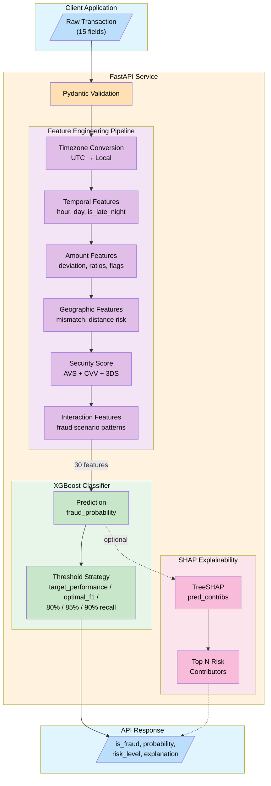
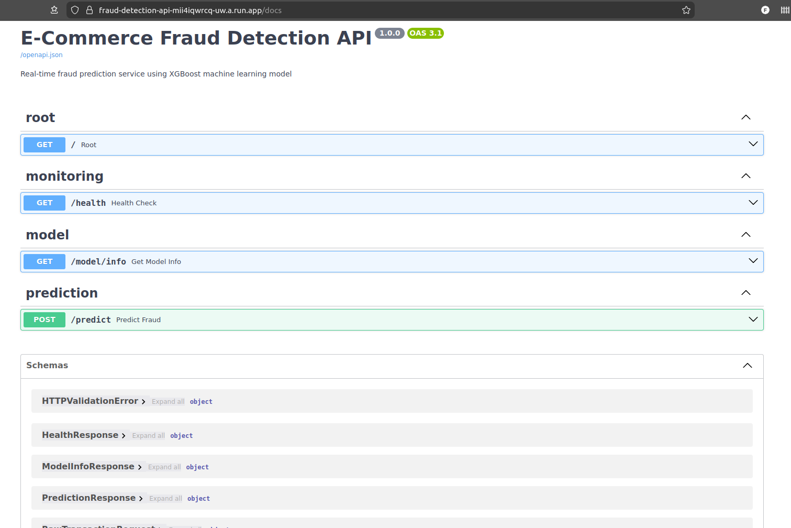
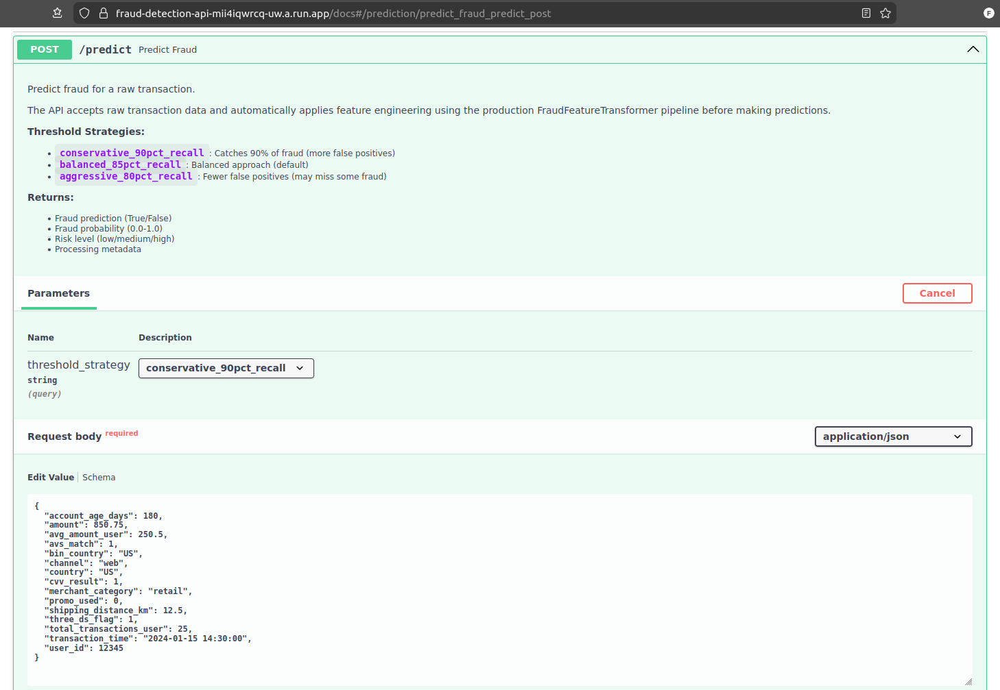
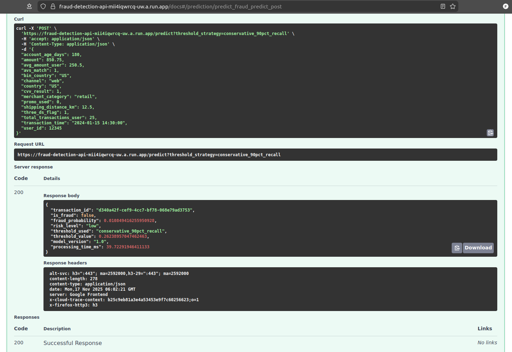

# E-Commerce Fraud Detection

A machine learning project to detect fraudulent e-commerce transactions using classification models. The goal is to develop, optimize, and deploy a production-ready fraud detection system.

## Table of Contents

### Introduction
- [Project Overview](#project-overview)
- [About This Project](#about-this-project)
- [Dataset](#dataset)
- [Technology Stack](#technology-stack)

### Setup
- [Getting Started](#getting-started)
  - [Prerequisites](#prerequisites)
  - [Installation](#installation)
- [Project Structure](#project-structure)

### Development
- [Development Guide](#development-guide)
  - [Virtual Environment & Package Management](#virtual-environment-and-package-management)
  - [Exploratory Data Analysis](#exploratory-data-analysis)
  - [Feature Engineering Development](#feature-engineering-development)
  - [Model Training & Hyperparameter Tuning](#model-training--hyperparameter-tuning)

### Production
- [Production Pipeline](#production-pipeline)
  - [Feature Engineering Pipeline](#feature-engineering-pipeline)
  - [Feature Engineering Summary](#feature-engineering-summary)
  - [Model Training Script](#model-training-script)
  - [Model Performance](#model-performance)

### Deployment
- [Deployment](#deployment)
  - [Deployment Plan](#deployment-plan)
  - [API Deployment Options](#api-deployment-options)
    - [Option 1: Local Development](#option-1-local-development-fastapi--uvicorn-)
    - [Option 2: Docker](#option-2-docker-deployment-recommended-for-production-)
    - [Option 3: Cloud](#option-3-cloud-deployment-)
  - [API Usage Examples](#api-usage-examples)

### Testing & Performance
- [Testing](#testing)
- [Performance Benchmarking](#performance-benchmarking)

### Additional Information
- [Contributing](#contributing)
- [License](#license)
- [Acknowledgments](#acknowledgments)
- [Contact](#contact)
- [Resources](#resources)

---

## Project Overview

This project builds and deploys a classification model to identify fraudulent e-commerce transactions in real-time. Using a realistic synthetic dataset that models actual fraud patterns observed in 2024, the system aims to help e-commerce platforms prevent fraudulent activity while minimizing false positives that could impact legitimate customers.

**Project Goal**: Deploy an optimally trained classification model capable of identifying fraudulent transactions with high precision and recall, packaged as a REST API service.

### System Architecture



**Key Components:**
- **Feature Engineering**: Transforms 15 raw fields into 30 engineered features using production `FraudFeatureTransformer`
- **XGBoost Model**: Tuned classifier with PR-AUC 0.87, optimized for fraud detection
- **Threshold Strategies**: 5 configurable precision-recall trade-offs (target_performance recommended, optimal_f1, plus 80%, 85%, 90% recall targets)
- **SHAP Explainability**: Optional per-prediction explanations showing top risk-increasing features

### Example Fraud Patterns Detected
- Card testing with small-value purchases (e.g., $1 transactions at midnight)
- Geographic anomalies (e.g., gaming accessories shipped 5,000 km away)
- Promo code abuse from newly created accounts
- Mismatched verification signals (AVS, CVV, 3D Secure)

## About This Project

This project is being developed as part of the [DataTalksClub Machine Learning Zoomcamp](https://github.com/DataTalksClub/machine-learning-zoomcamp), a comprehensive course covering:
- Machine learning fundamentals
- Model training and evaluation
- Deployment and MLOps practices
- Production-ready ML systems

## Dataset

**Source**: [Kaggle - E-Commerce Fraud Detection Dataset](https://www.kaggle.com/datasets/umuttuygurr/e-commerce-fraud-detection-dataset)

### Dataset Characteristics
- **Size**: 299,695 transactions
- **Features**: 17 columns (user behavior, transaction details, security flags, geographic data)
- **Target**: `is_fraud` (binary classification)
- **Class Distribution**:
  - Normal transactions: 97.8%
  - Fraudulent transactions: 2.2%
  - **Imbalance ratio**: 44:1 (significant class imbalance)
- **Quality**: No missing values, no duplicates

### Key Features
- **User Behavior**: Account age, transaction history, average spend patterns
- **Transaction Details**: Amount, timestamp, merchant category, channel (web/app)
- **Geographic Data**: User country, card-issuing bank country, shipping distance
- **Security Signals**: AVS match, CVV result, 3D Secure flag, promo code usage

## Technology Stack

### Data Science & ML
- **Python**: 3.12+
- **Data Processing**: pandas, numpy
- **Visualization**: matplotlib, seaborn
- **ML Models**: scikit-learn, xgboost
- **Explainability**: shap (SHAP values for model interpretation)
- **Statistics**: statsmodels
- **Timezone Handling**: pytz (UTC to local time conversion)
- **Testing**: pytest (unit and integration tests)
- **Performance Testing**: locust (load testing), requests (HTTP benchmarks)
- **Notebook Environment**: Jupyter

### Deployment
- **Feature Engineering**: Production-ready sklearn-compatible transformer
- **API Framework**: FastAPI
- **ASGI Server**: Uvicorn
- **Containerization**: Docker
- **Package Management**: uv (fast Python package installer)

## Project Structure

```
.
├── train.py                            # Model training script
├── predict.py                          # FastAPI prediction service
├── notebooks/                          # Jupyter notebooks
│   ├── fd1_EDA_FE.ipynb                # Notebook 1: EDA & feature engineering
│   ├── fd2_model_selection_tuning.ipynb # Notebook 2: Model selection & tuning
│   └── fd3_model_evaluation_deployment.ipynb # Notebook 3: Evaluation & deployment
├── docs/                               # Supplementary documentation
│   ├── CHANGES_SUMMARY.md              # Summary of major changes
│   ├── GCP_DEPLOYMENT.md               # Google Cloud Run deployment guide
│   └── REFACTORING_SUMMARY.md          # Code refactoring documentation
├── analysis/                           # Analysis scripts
│   └── bias_variance_analysis.py       # Bias-variance diagnostics script
├── benchmarks/                         # Performance testing suite
│   ├── benchmark.py                    # Custom benchmarking script
│   ├── locustfile.py                   # Load testing configuration (Locust)
│   └── results/                        # Generated outputs (gitignored)
├── data/                               # Dataset directory (gitignored)
│   └── transactions.csv                # Raw transaction data from Kaggle
├── src/                                # Source code modules
│   ├── deployment/                     # Production code for model deployment
│   │   ├── config/                     # Configuration management
│   │   │   ├── data_config.py          # Data loading configuration
│   │   │   ├── model_config.py         # Hyperparameters & feature lists
│   │   │   ├── training_config.py      # CV strategy & thresholds
│   │   │   └── __init__.py             # Package exports
│   │   ├── data/                       # Data loading utilities
│   │   │   ├── loader.py               # load_and_split_data()
│   │   │   └── __init__.py             # Package exports
│   │   ├── preprocessing/              # Feature engineering pipeline
│   │   │   ├── config.py               # FeatureConfig dataclass
│   │   │   ├── features.py             # Feature engineering functions
│   │   │   ├── transformer.py          # FraudFeatureTransformer (sklearn-compatible)
│   │   │   ├── pipelines.py            # PreprocessingPipelineFactory
│   │   │   └── __init__.py             # Package exports
│   │   ├── evaluation/                 # Model evaluation utilities
│   │   │   ├── metrics.py              # evaluate_model()
│   │   │   ├── thresholds.py           # optimize_thresholds()
│   │   │   └── __init__.py             # Package exports
│   │   └── explainability/             # SHAP-based prediction explanations
│   │       ├── __init__.py             # Package exports
│   │       ├── shap_explainer.py       # FraudExplainer class
│   │       └── feature_descriptions.py # Human-readable feature names
│   ├── fd1_nb/                         # Notebook 1 utility functions (EDA & FE)
│   │   ├── __init__.py                 # Package exports (21 functions)
│   │   ├── data_utils.py               # Data loading, splitting, analysis
│   │   ├── eda_utils.py                # EDA functions (VIF, correlations, MI)
│   │   └── feature_engineering.py      # Feature engineering utilities
│   ├── fd2_nb/                         # Notebook 2 utility functions (Model Selection & Tuning)
│   │   ├── __init__.py                 # Package exports (14 functions)
│   │   ├── model_comparison.py         # Model comparison and visualization
│   │   ├── hyperparameter_tuning.py    # GridSearchCV/RandomizedSearchCV utilities
│   │   ├── cv_analysis.py              # CV results analysis and train-val gap detection
│   │   └── bias_variance.py            # Bias-variance diagnostics
│   └── fd3_nb/                         # Notebook 3 utility functions (Evaluation & Deployment)
│       ├── __init__.py                 # Package exports (18 functions)
│       ├── evaluation.py               # Model evaluation and performance comparison
│       ├── visualization.py            # ROC/PR curves, SHAP beeswarm plots
│       ├── threshold_optimization.py   # Threshold optimization strategies
│       ├── feature_importance.py       # Feature importance (XGBoost gain + SHAP)
│       └── deployment.py               # Deployment artifact generation
├── tests/                              # Test suite (425 passing tests)
│   ├── conftest.py                     # Shared pytest fixtures
│   ├── test_api.py                     # API integration tests (33 tests)
│   ├── test_config/                    # Shared config tests (44 tests)
│   ├── test_data/                      # Data loading tests (12 tests)
│   ├── test_eda/                       # EDA utility tests (68 tests)
│   ├── test_evaluation/                # Evaluation tests (26 tests)
│   ├── test_explainability/            # Explainability tests (9 tests)
│   ├── test_fd2_nb/                    # Notebook 2 utility tests (63 tests)
│   ├── test_fd3_nb/                    # Notebook 3 utility tests (83 tests)
│   └── test_preprocessing/             # Preprocessing tests (61 tests)
├── models/                             # Model artifacts (tracked in git)
│   ├── xgb_fraud_detector.joblib       # Trained XGBoost model (~156KB)
│   ├── transformer_config.json         # Feature engineering configuration
│   ├── model_metadata.json             # Model version, hyperparameters, metrics
│   ├── threshold_config.json           # Optimized decision thresholds
│   ├── feature_lists.json              # Feature names and categorization
│   ├── best_params.json                # Optimal hyperparameters (from fd2)
│   ├── validation_metrics.json         # Validation metrics (from fd2)
│   └── logs/                           # Hyperparameter tuning logs (gitignored)
├── images/                             # Screenshots and documentation images
├── Dockerfile                          # Container image definition
├── docker-compose.yml                  # Local Docker deployment
├── requirements.txt                    # Python dependencies (pip format)
├── pyproject.toml                      # Python dependencies (uv format)
├── uv.lock                             # Locked dependency versions
├── .gitignore                          # Git exclusions
├── claude.md                           # Project context for Claude Code
└── README.md                           # This file
```

## Getting Started

### Prerequisites

1. **Python 3.12+**
   ```bash
   python --version  # Verify installation
   ```

2. **uv Package Manager**
   ```bash
   # Install uv if not already installed
   curl -LsSf https://astral.sh/uv/install.sh | sh
   ```

3. **Kaggle API Credentials (Optional)**
  - Create an account at [kaggle.com](https://www.kaggle.com)
  - Go to Account settings → API → Create New Token
  - Place the downloaded `kaggle.json` in `~/.kaggle/`
  - Set permissions: `chmod 600 ~/.kaggle/kaggle.json`

### Installation

1. **Clone the repository**
   ```bash
   git clone https://github.com/frederick-douglas-pearce/e-commerce-fraud-detection.git
   cd e-commerce-fraud-detection
   ```

2. **Install dependencies**
   ```bash
   uv sync
   ```

3. **Launch Jupyter Notebook**
   ```bash
   uv run --with jupyter jupyter lab
   ```

4. **Run the notebooks in sequence** (in `notebooks/` folder)
  - **Step 1**: Open `notebooks/fd1_EDA_FE.ipynb` for EDA and feature engineering
    - Run cells sequentially
    - Dataset will auto-download on first run if not present
  - **Step 2**: Open `notebooks/fd2_model_selection_tuning.ipynb` for model selection and tuning
    - Run cells sequentially
    - Generates `models/best_params.json` and `models/validation_metrics.json`
  - **Step 3**: Open `notebooks/fd3_model_evaluation_deployment.ipynb` for final evaluation
    - Run cells sequentially
    - Loads parameters from step 2
    - Generates deployment artifacts in `models/`

## Development Guide

This section covers the development process for exploring the data, engineering features, and training models using Jupyter notebooks.

### Virtual Environment and Package Management

```bash
# Add new dependencies
uv add <package-name>

# Update dependencies
uv sync

# Run Jupyter notebook
uv run --with jupyter jupyter lab
```

### Notebook Workflow

The project uses a modular three-notebook workflow for clear separation of concerns:

**Notebook 1: EDA & Feature Engineering** (`notebooks/fd1_EDA_FE.ipynb`)

This notebook contains:
1. **Data Loading**: Automated Kaggle dataset download with caching
2. **Preprocessing**: Data cleaning, type conversion, train/val/test splits (60/20/20, stratified)
3. **EDA**: Comprehensive exploratory data analysis
  - Target distribution and class imbalance analysis (44:1 ratio)
  - Numeric feature distributions and correlations
  - Categorical feature fraud rates and mutual information
  - Temporal pattern analysis
  - Multicollinearity detection (VIF)
4. **Feature Engineering Development**: 32 engineered features were created and evaluated:
  - **Temporal**: UTC and local timezone features (hour, day_of_week, is_late_night, etc.)
  - **Amount**: Deviation, ratios, micro/large transaction flags
  - **User Behavior**: Transaction velocity, new account flags, frequency indicators
  - **Geographic**: Country mismatch, high-risk distance, zero distance
  - **Security**: Composite security score from verification flags
  - **Interaction**: Fraud scenario-specific combinations (e.g., new_account_with_promo)
5. **Feature Selection**: Final selection of **30 features** from 45 available
  - Removed redundant features (UTC features, duplicate country fields)
  - Excluded low-signal features (merchant_category)
  - Prioritized interpretability and fraud scenario alignment
6. **Production Configuration**: Generates `FraudFeatureTransformer` configuration for deployment
  - Automatically creates `transformer_config.json` from training data
  - Stores quantile thresholds (95th/75th percentiles) for feature engineering
  - Saves 30 selected feature names with categorical groupings
  - Includes timezone mappings for 10 countries
  - Ensures consistent feature engineering between training and inference

**Notebook 2: Model Selection & Hyperparameter Tuning** (`notebooks/fd2_model_selection_tuning.ipynb`)

This notebook contains:
1. **Data Loading**: Loads raw transaction data and applies `FraudFeatureTransformer` pipeline
  - Applies production feature engineering consistently across train/val/test splits
  - Generates 30 engineered features from 15 raw transaction fields
  - Uses same transformer configuration as deployment API
2. **Preprocessing**: Model-specific transformations (one-hot encoding, scaling)
3. **Baseline Models**: Logistic Regression, Random Forest, XGBoost (all trained)
4. **Hyperparameter Tuning**: Flexible GridSearchCV/RandomizedSearchCV with detailed logging
  - Random Forest: GridSearchCV over 8 parameter combinations
  - XGBoost: GridSearchCV over 108 combinations (tuned scale_pos_weight, gamma, learning_rate)
5. **CV Results Analysis**: Production-focused evaluation of model stability and timing
  - Comprehensive CSV logging of all CV results
  - Stability analysis (std_test_score across folds)
  - Timing measurements with appropriate caveats for parallel processing
6. **Bias-Variance Analysis**: Train-validation gap and CV fold variance diagnostics
  - XGBoost iteration tracking to find optimal n_estimators
  - Model stability assessment across CV folds
7. **Evaluation**: ROC-AUC, PR-AUC, F1, Precision-Recall metrics (appropriate for imbalanced data)
8. **Model Selection**: XGBoost (Tuned) selected as best performer (PR-AUC: 0.868)
9. **Output**: Saves trained model and configuration for next notebook
  - `models/best_model.joblib` - Trained XGBoost pipeline (preprocessing + classifier)
  - `models/best_params.json` - Optimal hyperparameters
  - `models/validation_metrics.json` - CV performance metrics

**Notebook 3: Final Evaluation & Deployment** (`notebooks/fd3_model_evaluation_deployment.ipynb`)

This notebook contains:
1. **Model Loading**: Loads trained model from `models/best_model.joblib` (trained in Notebook 2)
   - Also loads `validation_metrics.json` for comparison with test set performance
2. **Data Preparation**: Recreates train/val/test splits with same random seed
3. **Test Set Evaluation**: Unbiased evaluation on completely held-out test set
   - Model was trained on train+val combined (239,756 samples) in Notebook 2
   - Test set (59,939 samples) never seen during training or hyperparameter tuning
4. **Performance Visualization**: ROC/PR curves on test data
5. **Feature Importance**: SHAP-based analysis with beeswarm plots
   - SHAP values computed using XGBoost native `pred_contribs=True`
   - Guidance on interpreting global vs per-sample SHAP values
   - Per-sample SHAP examples previewing API explainability behavior
6. **Threshold Optimization**: Calibration of precision-recall trade-offs
   - 5 threshold strategies: target_performance, optimal_f1, 80%/85%/90% recall
7. **Deployment Artifacts**: Saves configuration files to `models/`
   - `threshold_config.json` - Optimal thresholds for different strategies
   - `model_metadata.json` - Model version, hyperparameters, performance metrics
   - `feature_lists.json` - Categorized feature names
8. **Model Card**: Comprehensive documentation of model capabilities and limitations

**Workflow Benefits**:
- **Clear separation**: EDA → Selection → Deployment stages
- **Focused notebooks**: Each notebook has manageable size and single purpose
- **Proper holdout**: Test set only evaluated in final notebook
- **Reproducibility**: JSON files enable independent execution
- **Modularity**: Easy to re-run specific stages without full pipeline

### Model Training Strategy
Given the 44:1 class imbalance, the project employs:
- **Stratified sampling** to maintain class distribution across splits
- **Class weighting** in model training (class_weight='balanced', scale_pos_weight)
- **Appropriate metrics**: PR-AUC (primary), ROC-AUC, F1, Precision-Recall (not accuracy)
- **Threshold tuning** to optimize precision/recall trade-offs
- **4-fold Stratified CV** for hyperparameter optimization

**Hyperparameter Tuning Features**

The modeling pipeline includes production-ready tuning capabilities:

**Two-Stage Tuning Approach:**
- **Stage 1 (Exploration)**: RandomizedSearchCV with broad parameter ranges identifies stable parameters that remain unchanged across top-performing models
- **Stage 2 (Refinement)**: GridSearchCV on a focused parameter subset with narrow ranges, guided by Stage 1 insights
- Applied to Random Forest and XGBoost for efficient, thorough hyperparameter optimization

**Critical Hyperparameter Finding:**
- XGBoost's `scale_pos_weight` primarily controls the recall/precision trade-off and was included in the hyperparameter search space
- Using the actual class imbalance ratio (44:1) produced excessive false positives
- Optimal value of 8 (5.5× lower than class imbalance) achieved performance targets for both metrics
- Key tuning parameter for adapting model behavior to changing business requirements

**Flexible Search Strategy:**
- Switch between GridSearchCV and RandomizedSearchCV with a single parameter
- Automatic calculation of total parameter combinations
- Support for both exhaustive and random search approaches

**Comprehensive Logging:**
- Detailed CV results exported to timestamped CSV files
- Verbose output captured to log files
- All parameter combinations and scores preserved for analysis

**Production-Focused Analysis:**
- Model stability evaluation (std_test_score across CV folds)
- Timing measurements with appropriate caveats for parallel processing
- Top N candidates comparison for trade-off analysis
- Automated recommendations for model selection
- Visual analysis of performance vs stability trade-offs

**Key Insights:**
- Timing metrics are unreliable with parallel CV (measurement artifacts)
- Focus on PR-AUC and stability for model selection
- Production API latency testing provides definitive performance numbers

---

## Production Pipeline

This section covers the production-ready components: the feature engineering transformer, model training script, and performance metrics.

### Feature Engineering Pipeline

The project includes a production-ready feature engineering pipeline (`src/deployment/preprocessing/`) designed for deployment. This sklearn-compatible transformer ensures consistent feature engineering between training and inference.

**Architecture Overview**

**Design Pattern**: Hybrid Class + Config (sklearn-compatible transformer with JSON configuration)

**Key Components**:
1. **`FraudFeatureTransformer`** - Sklearn-compatible transformer class
   - `fit(X)` - Calculates quantile thresholds from training data
   - `transform(X)` - Applies feature engineering pipeline
   - `save(path)` / `load(path)` - Persists configuration as JSON

2. **`FeatureConfig`** - Type-safe configuration dataclass
   - Stores training-time statistics (95th/75th percentile thresholds)
   - Timezone mappings for 10 countries
   - List of 30 final selected features
   - JSON serialization for version control

3. **Feature Engineering Functions** - Modular, testable functions
   - Timezone conversion (UTC → local time by country)
   - Temporal, amount, behavior, geographic, security features
   - Fraud scenario-specific interaction features

**Usage**

Training Workflow:
```python
from src.deployment.preprocessing import FraudFeatureTransformer

# Fit transformer on training data
transformer = FraudFeatureTransformer()
transformer.fit(train_df)  # Calculates quantile thresholds
X_train = transformer.transform(train_df)

# Save configuration for deployment
transformer.save("models/transformer_config.json")
```

Inference Workflow:
```python
# Load transformer with saved configuration
transformer = FraudFeatureTransformer.load("models/transformer_config.json")
X_new = transformer.transform(new_df)
```

Sklearn Pipeline Integration:
```python
from sklearn.pipeline import Pipeline
from sklearn.linear_model import LogisticRegression

pipeline = Pipeline([
    ('feature_engineering', FraudFeatureTransformer()),
    ('classifier', LogisticRegression())
])
pipeline.fit(train_df, y_train)
predictions = pipeline.predict(test_df)
```

**Benefits**

✅ **Sklearn Pipeline compatible** - Standard fit/transform API
✅ **Lightweight** - JSON config (not pickled Python objects)
✅ **Version control friendly** - Config changes visible in diffs
✅ **Type-safe** - Dataclass with validation
✅ **Fully tested** - 41 passing tests with edge case coverage
✅ **Production-ready** - Industry standard pattern

**Configuration File**

The `transform_config.json` file stores:
```json
{
  "amount_95th_percentile": 595.97,
  "total_transactions_75th_percentile": 56,
  "shipping_distance_75th_percentile": 408.9,
  "timezone_mapping": { "US": "America/New_York", ... },
  "final_features": [ "account_age_days", "amount", ... ],
  "date_col": "transaction_time",
  "country_col": "country"
}
```

### Feature Engineering Summary

This section provides a detailed breakdown of the 30 final features used in production, targeting the three specific fraud scenarios:

**Engineered Features (30 selected from 32 created)**

**1. Temporal Features (6) - Local Timezone**
- `hour_local`, `day_of_week_local`, `month_local`
- `is_weekend_local`, `is_late_night_local` (11 PM - 4 AM), `is_business_hours_local`
- **Why local time?** Better captures human behavior patterns. Fraud at "2 AM local" is suspicious regardless of UTC time.

**2. Transaction Amount Features (4)**
- `amount_deviation` - Absolute deviation from user's average
- `amount_vs_avg_ratio` - Ratio of transaction to user average
- `is_micro_transaction` - Flags amounts ≤$5 (card testing pattern)
- `is_large_transaction` - Flags 95th percentile+ amounts

**3. User Behavior Features (3)**
- `transaction_velocity` - Transactions per day of account age
- `is_new_account` - Accounts <30 days old (promo abuse pattern)
- `is_high_frequency_user` - 75th percentile+ transaction count

**4. Geographic Features (3)**
- `country_mismatch` - User country ≠ card issuing country (replaces separate fields)
- `high_risk_distance` - Shipping distance >75th percentile
- `zero_distance` - Billing = shipping address (lower risk)

**5. Security Features (1)**
- `security_score` - Composite score: avs_match + cvv_result + three_ds_flag (0-3)

**6. Interaction Features (3) - Fraud Scenario Specific**
- `new_account_with_promo` → **Scenario #3**: Promo abuse from fresh accounts
- `late_night_micro_transaction` → **Scenario #1**: Card testing at midnight
- `high_value_long_distance` → **Scenario #2 variant**: Large amounts shipped far

**Original Features Retained (10)**
- Numeric (5): account_age_days, total_transactions_user, avg_amount_user, amount, shipping_distance_km
- Categorical (5): channel, promo_used, avs_match, cvv_result, three_ds_flag

**Total: 30 features + 1 target = 31 columns**

### Model Training Script

Train the fraud detection model using the provided training script.

**Prerequisites**
1. Raw transaction data must exist in `data/` directory:
  - `transactions.csv` (download from Kaggle)

**Note:** The training script uses raw transaction data and applies the production `FraudFeatureTransformer` pipeline, ensuring consistency between training and inference. All feature engineering is performed on-the-fly using the same transformer configuration deployed in the API.

**Training the Model**

```bash
# Basic training (uses optimal hyperparameters, skips tuning for speed)
uv run python train.py --skip-tuning

# Full training with hyperparameter tuning (takes longer)
uv run python train.py

# Custom training options
uv run python train.py \
  --data-dir data \
  --output-dir models \
  --random-seed 42 \
  --verbose
```

**Output artifacts** (saved to `models/` directory):
- `xgb_fraud_detector.joblib` - Trained XGBoost model pipeline
- `transformer_config.json` - Feature transformer configuration (quantile thresholds)
- `threshold_config.json` - Optimized decision thresholds
- `model_metadata.json` - Model info, hyperparameters, performance
- `feature_lists.json` - Feature categorization
- `training_report.txt` - Detailed training summary

### Model Performance

**Target Metrics (Production Deployment)**
- **PR-AUC**: > 0.85
- **ROC-AUC**: > 0.95
- **F1 Score**: > 0.75
- **Recall**: > 0.80 (prioritize catching fraud)
- **Precision**: > 0.70 (minimize false positives)
- **Inference Time**: < 100ms per prediction

**Achieved Results (XGBoost Tuned - Validation Set)**
- **PR-AUC**: 0.8679 ✅ (Target: > 0.85)
- **ROC-AUC**: 0.9790 ✅ (Target: > 0.95)
- **F1 Score**: 0.7756 ✅ (Target: > 0.75)
- **Recall**: 0.8360 ✅ (Target: > 0.80)
- **Precision**: 0.7233 ✅ (Target: > 0.70)
- **Inference Time (P95)**: 33.84ms ✅ (Target: < 50ms)
- **Inference Time (P99)**: 39.54ms ✅ (Target: < 100ms)

**Model Details:**
- Best hyperparameters: n_estimators=100, max_depth=4, learning_rate=0.1, scale_pos_weight=8
- Confusion Matrix: TN=58,206 | FP=410 | FN=222 | TP=1,101
- Excellent precision-recall balance for fraud detection
- Significant improvement over baseline (+31.5% precision, +2.5% PR-AUC)

---

## Deployment

This section covers deployment options, the deployment roadmap, and API usage examples.

### Deployment Plan

**Phase 1: Model Development & Feature Engineering ✅ (100% Complete)**
- [x] Dataset acquisition and exploration
- [x] Initial EDA and data quality checks
- [x] Preprocessing pipeline setup (stratified splits, type conversion)
- [x] Comprehensive exploratory data analysis
- [x] Feature engineering (32 features created)
- [x] Final feature selection (30 features selected)
- [x] Dataset persistence for modeling
- [x] **Production feature engineering pipeline** (sklearn-compatible)
- [x] **Comprehensive test suite** (41 passing tests)
- [x] **Configuration management** (JSON-based FeatureConfig)
- [x] **Baseline model training** (Logistic Regression, Random Forest, XGBoost)
- [x] **Hyperparameter tuning** (Random Forest and XGBoost optimized)
- [x] **CV analysis tooling** (Production-focused stability and timing evaluation)
- [x] **Model selection** (XGBoost Tuned - PR-AUC: 0.8679)
- [x] **Test set evaluation** (PR-AUC: 0.8679, excellent generalization)
- [x] **Feature importance analysis** (XGBoost built-in + SHAP values)
- [x] **Threshold optimization** (Multiple recall targets: 80%, 85%, 90%)
- [x] **Model persistence and deployment package** (Model, metadata, thresholds, model card)

**Phase 2: API Development ✅ (100% Complete)**
- [x] Create FastAPI application structure
- [x] Implement prediction endpoint with Pydantic validation
- [x] Add input validation and comprehensive error handling
- [x] Create health check and monitoring endpoints
- [x] Write API documentation (OpenAPI/Swagger)
- [x] Multiple threshold strategies (conservative/balanced/aggressive)
- [x] Request logging and structured error responses
- [x] Comprehensive API integration tests (41 test cases)

**Phase 3: Containerization ✅ (100% Complete)**
- [x] Create Dockerfile with multi-stage build
- [x] Optimize container image size (<500MB target)
- [x] Add docker compose for local development
- [x] Test containerized application
- [x] Security hardening (non-root user, health checks)
- [x] Build context optimization (.dockerignore)

**Phase 4: Production Deployment ✅ (100% Complete)**
- [x] Implement logging and monitoring endpoints
- [x] Model artifact management and versioning
- [x] Automated testing (pytest integration)
- [x] Deploy to cloud platform (Google Cloud Run/AWS/Azure)

**Phase 5: Deployment Automation/Monitoring (Future Work)**
- [ ] Set up CI/CD pipeline (GitHub Actions)
- [ ] Production monitoring dashboard
- [ ] Model performance tracking and alerting
- [ ] Model drift detection

### API Deployment Options

Deploy the fraud detection model as a production REST API.

#### Option 1: Local Development (FastAPI + Uvicorn) ✅

**1. Install Dependencies**
```bash
# Using uv (recommended)
uv sync

# Or using pip
pip install -r requirements.txt
```

**2. Train Model (if not already trained)**
```bash
uv run python train.py --skip-tuning
```

**3. Start API Server**
```bash
# Development mode with auto-reload
uv run uvicorn predict:app --reload --host 0.0.0.0 --port 8000

# Production mode
uv run uvicorn predict:app --host 0.0.0.0 --port 8000 --workers 4
```

**4. Access API**
- **Interactive Docs**: http://localhost:8000/docs
- **Alternative Docs**: http://localhost:8000/redoc
- **Health Check**: http://localhost:8000/health
- See the **API Usage Examples** section below for additional test commands

#### Option 2: Docker Deployment (Recommended for Production) ✅

**1. Build Docker Image**
```bash
# Build the image (1.5 - 2 minutes)
docker build -t fraud-detection-api .

# Check image size (~1.5GB)
docker images fraud-detection-api
```

**2. Run Container**
```bash
# Run with docker
docker run -d \
  --name fraud-detection-api \
  -p 8000:8000 \
  fraud-detection-api

# Or use docker compose (easier)
docker compose up -d
```

**3. Verify Deployment**

See the **API Usage Examples** section for additional test commands
```bash
# Check health
curl http://localhost:8000/health

# View logs
docker logs fraud-detection-api

# Stop container
docker compose down
```

#### Option 3: Cloud Deployment ✅

**Google Cloud Run (Serverless, Auto-scaling)**

**Why Cloud Run?**
- Serverless architecture with no infrastructure management
- Auto-scales from 0 to 1000+ instances based on traffic
- Pay-per-use pricing with generous free tier
- Fast cold starts (<1 second) and automatic HTTPS

**Deployment Status:** This API is deployed and available for testing.

**📖 Full Deployment Guide:** See [docs/GCP_DEPLOYMENT.md](docs/GCP_DEPLOYMENT.md) for complete step-by-step deployment instructions including:
- Initial setup and authentication
- Building and pushing Docker images
- Deployment configuration
- Production settings (authentication, monitoring, auto-scaling)
- Troubleshooting and maintenance
- Cost estimation

**Testing the Cloud Deployed API**

The API is deployed for review, and it can optionally be tested using the commands described below. I've included a few snapshots of the API's docs page to prove that the cloud-hosted API is available and working correctly. The url to the cloud hosted API is required for testing, but it has not been commited to the repo directly. Instead, it is available in the provided snapshots. Just fill in the SERVICE_URL below with the relevant details from the url in the snapshots, then run the commands for testing the API.


*API Documentation - Interactive Swagger UI showing available endpoints*


*Predict Endpoint - Example request with transaction data*


*Predict Endpoint - Example response with fraud prediction*

```bash
# Set the service URL (replace x values with actual Cloud Run URL ID from snapshots)
export SERVICE_URL="https://fraud-detection-api-xxxxxxxxxx-uw.a.run.app"

# Test health endpoint
uv run curl $SERVICE_URL/health | python -m json.tool

# Expected response:
# {
#   "status": "healthy",
#   "model_loaded": true,
#   "model_version": "1.0",
#   "uptime_seconds": 12.34,
#   "timestamp": "2025-11-16T..."
# }

# Test prediction endpoint - Normal transaction
uv run curl -X POST "$SERVICE_URL/predict" \
  -H "Content-Type: application/json" \
  -d '{
    "user_id": 12345,
    "account_age_days": 180,
    "total_transactions_user": 25,
    "avg_amount_user": 250.50,
    "amount": 850.75,
    "country": "US",
    "bin_country": "US",
    "channel": "web",
    "merchant_category": "retail",
    "promo_used": 0,
    "avs_match": 1,
    "cvv_result": 1,
    "three_ds_flag": 1,
    "shipping_distance_km": 12.5,
    "transaction_time": "2024-01-15 14:30:00"
  }' | python -m json.tool

# Test prediction endpoint - Suspicious transaction
uv run curl -X POST "$SERVICE_URL/predict" \
  -H "Content-Type: application/json" \
  -d '{
    "user_id": 12345,
    "account_age_days": 180,
    "total_transactions_user": 25,
    "avg_amount_user": 250.50,
    "amount": 850.75,
    "country": "US",
    "bin_country": "US",
    "channel": "web",
    "merchant_category": "retail",
    "promo_used": 0,
    "avs_match": 0,
    "cvv_result": 0,
    "three_ds_flag": 0,
    "shipping_distance_km": 1222.5,
    "transaction_time": "2024-01-15 14:30:00"
  }' | python -m json.tool

# Access interactive API documentation
open "$SERVICE_URL/docs"
```

### API Usage Examples

These examples work for both local and cloud deployments. For cloud deployments, replace `http://localhost:8000` with your cloud service URL.

#### Prediction Endpoint

Make fraud predictions for transactions using the `/predict` endpoint.

The API accepts **raw transaction data** (15 fields) and automatically applies feature engineering using the production `FraudFeatureTransformer` pipeline before making predictions.

**Request:**
```bash
curl -X POST "http://localhost:8000/predict?threshold_strategy=balanced_85pct_recall" \
  -H "Content-Type: application/json" \
  -d '{
    "user_id": 12345,
    "account_age_days": 180,
    "total_transactions_user": 25,
    "avg_amount_user": 250.50,
    "amount": 850.75,
    "country": "US",
    "bin_country": "US",
    "channel": "web",
    "merchant_category": "retail",
    "promo_used": 0,
    "avs_match": 1,
    "cvv_result": 1,
    "three_ds_flag": 1,
    "shipping_distance_km": 12.5,
    "transaction_time": "2024-01-15 14:30:00"
  }'
```

**Required Fields:**
- **User Information**: `user_id`, `account_age_days`, `total_transactions_user`, `avg_amount_user`
- **Transaction Details**: `amount`, `country`, `bin_country`, `channel`, `merchant_category`
- **Security Flags**: `promo_used`, `avs_match`, `cvv_result`, `three_ds_flag`
- **Geographic/Temporal**: `shipping_distance_km`, `transaction_time` (ISO format: `YYYY-MM-DD HH:MM:SS`)

**Note:** The API automatically generates 30 engineered features from these 15 raw fields using the production feature engineering pipeline.

**Response:**
```json
{
  "transaction_id": "550e8400-e29b-41d4-a716-446655440000",
  "is_fraud": false,
  "fraud_probability": 0.12,
  "risk_level": "low",
  "threshold_used": "balanced_85pct_recall",
  "threshold_value": 0.35,
  "model_version": "1.0",
  "processing_time_ms": 15.3,
  "explanation": null
}
```

#### Explainability Feature

Request SHAP-based explanations showing which features increased fraud risk:

```bash
curl -X POST "http://localhost:8000/predict?include_explanation=true&top_n=3" \
  -H "Content-Type: application/json" \
  -d @transaction.json
```

**Response with Explanation:**
```json
{
  "transaction_id": "...",
  "is_fraud": true,
  "fraud_probability": 0.85,
  "explanation": {
    "top_contributors": [
      {"feature": "avs_match", "display_name": "Address Verification Match", "value": 0, "contribution": 0.32},
      {"feature": "account_age_days", "display_name": "Account Age (days)", "value": 5, "contribution": 0.28},
      {"feature": "security_score", "display_name": "Security Score", "value": 1, "contribution": 0.15}
    ],
    "base_fraud_rate": 0.022,
    "explanation_method": "shap"
  }
}
```

**Parameters:**
- `include_explanation` (bool): Include SHAP-based feature explanations (default: false)
- `top_n` (int): Number of top contributing features (1-10, default: 3)

#### Threshold Strategies

Choose different risk tolerance levels:

| Strategy | Precision | Recall | Use Case |
|----------|-----------|--------|----------|
| `target_performance` | 70.0% | 83.2% | **RECOMMENDED** - Max recall with ≥70% precision |
| `optimal_f1` | 92.7% | 75.3% | Best F1 score - highest precision-recall balance |
| `conservative_90pct_recall` | 35.1% | 90.0% | Catch maximum fraud (more false positives) |
| `balanced_85pct_recall` | 58.5% | 85.0% | Balanced precision-recall trade-off |
| `aggressive_80pct_recall` | 81.9% | 80.0% | Prioritize precision, reduce false positives |

**Example - Conservative Strategy:**
```bash
curl -X POST "http://localhost:8000/predict?threshold_strategy=conservative_90pct_recall" \
  -H "Content-Type: application/json" \
  -d @transaction.json
```

#### Health Check
```bash
curl http://localhost:8000/health
```

**Response:**
```json
{
  "status": "healthy",
  "model_loaded": true,
  "model_version": "1.0",
  "uptime_seconds": 3600.5,
  "timestamp": "2025-01-14T10:30:00Z"
}
```

#### Model Information
```bash
curl http://localhost:8000/model/info
```

**Response:**
```json
{
  "model_name": "XGBoost Fraud Detector",
  "version": "1.0",
  "training_date": "2025-01-14T09:00:00",
  "algorithm": "XGBoost Gradient Boosting",
  "performance": {
    "pr_auc": 0.8679,
    "precision": 0.7233,
    "recall": 0.8360,
    "f1": 0.7756
  },
  "threshold_strategies": {
    "balanced_85pct_recall": {
      "threshold": 0.35,
      "precision": 0.72,
      "recall": 0.85
    }
  },
  "raw_features_required": [
    "user_id", "account_age_days", "total_transactions_user", "avg_amount_user",
    "amount", "country", "bin_country", "channel", "merchant_category",
    "promo_used", "avs_match", "cvv_result", "three_ds_flag",
    "shipping_distance_km", "transaction_time"
  ],
  "engineered_features_count": 30
}
```

---

## Testing

Run comprehensive test suite to verify all components: shared infrastructure, preprocessing pipeline, and API functionality.

### Test Organization

The test suite mirrors the source code structure with 425 passing tests:

```
tests/
├── test_api.py              # API integration tests (33 tests)
├── test_config/             # Shared config tests (44 tests)
│   ├── test_data_config.py       # DataConfig (16 tests)
│   ├── test_model_config.py      # ModelConfig, FeatureListsConfig (19 tests)
│   └── test_training_config.py   # TrainingConfig (9 tests)
├── test_data/               # Data loading tests (12 tests)
│   └── test_loader.py            # load_and_split_data()
├── test_eda/                # EDA utility tests (68 tests)
│   ├── test_data_utils.py        # Data loading/splitting utilities
│   ├── test_eda_utils.py         # VIF, correlations, mutual information
│   └── test_feature_engineering.py # Feature engineering functions
├── test_evaluation/         # Evaluation tests (26 tests)
│   ├── test_metrics.py           # calculate_metrics, evaluate_model (14 tests)
│   └── test_thresholds.py        # optimize_thresholds (12 tests)
├── test_explainability/     # Explainability tests (9 tests)
│   └── test_shap_explainer.py    # FraudExplainer class tests
├── test_fd2_nb/             # Notebook 2 utility tests (63 tests)
│   ├── test_bias_variance.py     # Bias-variance analysis (7 tests)
│   ├── test_cv_analysis.py       # CV results analysis (25 tests)
│   ├── test_hyperparameter_tuning.py # Tuning utilities (15 tests)
│   └── test_model_comparison.py  # Model comparison (16 tests)
├── test_fd3_nb/             # Notebook 3 utility tests (83 tests)
│   ├── test_deployment.py        # Model deployment utilities (26 tests)
│   ├── test_evaluation.py        # Model evaluation (15 tests)
│   ├── test_feature_importance.py # Feature importance extraction (19 tests)
│   ├── test_threshold_optimization.py # Threshold optimization (23 tests)
│   └── test_visualization.py     # SHAP beeswarm plot tests (7 tests)
└── test_preprocessing/      # Preprocessing tests (61 tests)
    ├── test_config.py            # FeatureConfig (8 tests)
    ├── test_features.py          # Feature engineering functions (15 tests)
    ├── test_pipelines.py         # PreprocessingPipelineFactory (18 tests)
    └── test_transformer.py       # FraudFeatureTransformer (20 tests)
```

### Running Tests

**All Tests** (Recommended):
```bash
# Run entire test suite
uv run pytest tests/ -v

# Quick smoke test (stop on first failure)
uv run pytest tests/ -x
```

**By Component**:
```bash
# Configuration tests
uv run pytest tests/test_config/ -v

# Data loading tests
uv run pytest tests/test_data/ -v

# EDA utility tests
uv run pytest tests/test_eda/ -v

# Evaluation tests
uv run pytest tests/test_evaluation/ -v

# Explainability tests
uv run pytest tests/test_explainability/ -v

# fd2 notebook utility tests
uv run pytest tests/test_fd2_nb/ -v

# fd3 notebook utility tests
uv run pytest tests/test_fd3_nb/ -v

# Preprocessing tests
uv run pytest tests/test_preprocessing/ -v

# API tests
uv run pytest tests/test_api.py -v
```

**Specific Test Files**:
```bash
# Test specific module
uv run pytest tests/test_config/test_model_config.py -v

# Test specific class
uv run pytest tests/test_api.py::TestPredictEndpoint -v

# Test with detailed output
uv run pytest tests/test_preprocessing/test_transformer.py -v --tb=short
```

### Test Coverage Summary

**425 total tests** covering:
- ✅ **Shared Configuration** (44 tests): DataConfig, ModelConfig, TrainingConfig
- ✅ **Data Loading** (12 tests): load_and_split_data with stratification validation
- ✅ **EDA Utilities** (68 tests): Data utils, EDA functions, feature engineering
- ✅ **Evaluation** (26 tests): Metrics calculation and threshold optimization
- ✅ **Explainability** (9 tests): FraudExplainer SHAP-based explanations
- ✅ **fd2 Notebook Utilities** (63 tests): Model comparison, hyperparameter tuning, CV analysis, bias-variance
- ✅ **fd3 Notebook Utilities** (83 tests): Evaluation, visualization, SHAP beeswarm, threshold optimization, deployment
- ✅ **Preprocessing** (61 tests): FeatureConfig, feature engineering functions, pipelines, transformer
- ✅ **API** (33 tests): Endpoints, validation, error handling, threshold strategies, explainability

**Key Test Features**:
- Comprehensive edge case coverage (division by zero, missing data)
- Fixtures for reusable test data (conftest.py)
- Integration tests for end-to-end workflows
- Performance validation (response times)
- All tests passing with 100% success rate

---

## Performance Benchmarking

Comprehensive performance testing suite to measure API latency and throughput.

### Running Benchmarks

#### Quick Benchmark (Python Script)

```bash
# Default benchmark (100 requests, 10 concurrent users)
uv run python benchmarks/benchmark.py --url http://localhost:8000

# Custom configuration
uv run python benchmarks/benchmark.py \
  --url http://localhost:8000 \
  --iterations 500 \
  --concurrent 20 \
  --output benchmarks/results/benchmark_results.json
```

**Metrics Measured:**
- **Cold Start**: First request latency (includes model loading overhead)
- **Single Request**: Sequential request latency (P50, P95, P99)
- **Concurrent Load**: Multi-user throughput (requests/second)
- **Server vs E2E**: Processing time vs total latency (network overhead)

#### Load Testing (Locust)

```bash
# Start Locust web UI
uv run locust -f benchmarks/locustfile.py --host=http://localhost:8000

# Headless mode with 50 users, run for 60 seconds
uv run locust -f benchmarks/locustfile.py \
  --host=http://localhost:8000 \
  --users 50 \
  --spawn-rate 10 \
  --run-time 60s \
  --headless

# Generate HTML report
uv run locust -f benchmarks/locustfile.py \
  --host=http://localhost:8000 \
  --users 100 \
  --spawn-rate 10 \
  --run-time 120s \
  --headless \
  --html=benchmarks/results/locust_report.html
```

**User Scenarios:**
- **Normal Transactions** (70% of traffic): Established accounts with typical amounts
- **Suspicious Transactions** (30% of traffic): New accounts with high amounts
- **Stress Test**: Rapid-fire requests with minimal wait time

### Benchmark Results

#### Docker Deployment (Local)

**Environment:**
- Platform: Linux (Ubuntu 24.04)
- Python: 3.12
- Deployment: Docker (docker compose)
- Date: 2025-11-15

**Single Request Performance (500 iterations):**

| Metric | Mean | Median | P95 | P99 |
|--------|------|--------|-----|-----|
| **Server Processing** | 19.94 ms | 18.51 ms | 33.84 ms | 39.54 ms |
| **End-to-End Latency** | 22.35 ms | 20.73 ms | 37.13 ms | 44.36 ms |
| **Network Overhead** | 2.41 ms | 2.10 ms | - | - |

**Concurrent Load Performance (20 concurrent users, 500 requests):**

| Metric | Value |
|--------|-------|
| **Throughput** | 48.16 requests/second |
| **Success Rate** | 100% |
| **Total Time** | 10.38 seconds |
| **Server P95** | 32.16 ms |
| **Server P99** | 37.10 ms |
| **E2E P95** | 557.64 ms |
| **E2E P99** | 603.04 ms |

**Cold Start Performance:**

| Metric | Latency |
|--------|---------|
| **Server Processing** | 52.37 ms |
| **End-to-End** | 54.98 ms |
| **Network Overhead** | 2.61 ms |

#### Google Cloud Run Deployment

**Environment:**
- Platform: Google Cloud Run (Serverless)
- Python: 3.12
- Region: us-west1
- Date: 2025-11-17

**Single Request Performance (500 iterations):**

| Metric | Mean | Median | P95 | P99 |
|--------|------|--------|-----|-----|
| **Server Processing** | 32.31 ms | 31.59 ms | 36.40 ms | 40.52 ms |
| **End-to-End Latency** | 162.49 ms | 154.49 ms | 226.87 ms | 252.56 ms |
| **Network Overhead** | 130.18 ms | 121.97 ms | - | - |

**Concurrent Load Performance (20 concurrent users, 500 requests):**

| Metric | Value |
|--------|-------|
| **Throughput** | 24.58 requests/second |
| **Success Rate** | 100% |
| **Total Time** | 20.34 seconds |
| **Server P95** | 53.52 ms |
| **Server P99** | 56.61 ms |
| **E2E P95** | 853.28 ms |
| **E2E P99** | 1001.01 ms |

**Cold Start Performance:**

| Metric | Latency |
|--------|---------|
| **Server Processing** | 210.89 ms |
| **End-to-End** | 470.76 ms |
| **Network Overhead** | 259.87 ms |

#### Performance Comparison: Docker vs Cloud Run

**Server Processing Time (Core Model Performance):**

| Metric | Docker (Local) | Cloud Run | Difference |
|--------|----------------|-----------|------------|
| **Mean** | 19.94 ms | 32.31 ms | +12.37 ms (+62%) |
| **Median** | 18.51 ms | 31.59 ms | +13.08 ms (+71%) |
| **P95** | 33.84 ms | 36.40 ms | +2.56 ms (+8%) |
| **P99** | 39.54 ms | 40.52 ms | +0.98 ms (+2%) |

**Key Insight:** Server processing times are remarkably similar at higher percentiles (P95/P99), with only ~2-3ms difference. Both deployments meet the target of <50ms P95.

**End-to-End Latency (User Experience):**

| Metric | Docker (Local) | Cloud Run | Difference |
|--------|----------------|-----------|------------|
| **P95** | 37.13 ms | 226.87 ms | +189.74 ms |
| **P99** | 44.36 ms | 252.56 ms | +208.20 ms |
| **Network Overhead** | ~2.4 ms | ~130 ms | +127.6 ms |

**Key Insight:** The significant E2E difference is entirely due to network latency (internet vs localhost), not model performance.

**Throughput & Reliability:**

| Metric | Docker (Local) | Cloud Run | Difference |
|--------|----------------|-----------|------------|
| **Throughput** | 48.16 RPS | 24.58 RPS | -49% |
| **Success Rate** | 100% | 100% | 0% |
| **Cold Start (E2E)** | 54.98 ms | 470.76 ms | +415.78 ms |

**Key Insight:** Docker achieves ~2x throughput due to local deployment. Cloud Run throughput is limited by network latency, but server processing remains fast. Cloud Run cold starts are longer due to serverless container initialization.

### Performance Analysis

#### Overall Results

✅ **Excellent Latency**: Both deployments achieve sub-40ms P95 server processing (Docker: 33.84ms, Cloud Run: 36.40ms - well below 50ms target)
✅ **Consistent Performance**: Minimal variance in server processing times across both environments
✅ **Production-Ready**: Both deployments meet all performance targets for fraud detection
✅ **High Reliability**: 100% success rate under load (500 requests) for both deployments
✅ **Highly Scalable**: Docker achieves 48.16 RPS locally; Cloud Run provides auto-scaling for traffic spikes

**Comprehensive Testing:** Results based on 500 iterations with 20 concurrent users, providing more accurate performance characterization than typical benchmarks.

#### Docker Deployment Insights

**Docker Overhead:** Cold start is ~52ms (vs ~26ms for local uvicorn), which is acceptable for production deployment. The containerization provides isolation and portability benefits with minimal performance impact.

**Network Overhead:** Average 2.4ms indicates local deployment, providing baseline for server performance.

**Concurrent Load:** E2E latency increases under concurrent load (557ms P95) due to request queueing, but server processing remains consistently fast (32.16ms P95).

#### Cloud Run Deployment Insights

**Serverless Benefits:** Auto-scaling, zero infrastructure management, and pay-per-use pricing make Cloud Run ideal for variable traffic patterns.

**Network Latency:** Average 130ms overhead is expected for internet-based deployment. This can be reduced by deploying to regions closer to users or using Cloud CDN.

**Cold Starts:** ~471ms E2E for first request after idle period. Can be eliminated by setting minimum instances (recommended for production).

**Server Performance:** Core model processing (36.4ms P95) is nearly identical to Docker, demonstrating consistent performance across environments.

**Production Considerations:**
- Set min instances to 1+ to avoid cold starts (~$6-10/month per instance)
- Deploy to multiple regions for lower latency globally
- Implement health check pings to keep instances warm
- Cloud Run auto-scales to handle traffic spikes without configuration

### Performance Targets vs Achieved

| Target | Docker (Local) | Cloud Run | Status |
|--------|----------------|-----------|--------|
| Server P95 < 50ms | 33.84 ms | 36.40 ms | ✅ Both Pass |
| Server P99 < 100ms | 39.54 ms | 40.52 ms | ✅ Both Pass |
| Throughput > 20 RPS | 48.16 RPS | 24.58 RPS | ✅ Both Pass |
| Success Rate 100% | 100% | 100% | ✅ Both Pass |

**Verdict:** Both Docker and Cloud Run deployments exceed all performance requirements. Choose Docker for maximum throughput in controlled environments, or Cloud Run for serverless auto-scaling and simplified operations.

---

## Contributing

This is a personal learning project, but suggestions and feedback are welcome! Feel free to:
- Open issues for bugs or suggestions
- Submit pull requests with improvements
- Share ideas for model improvements or deployment strategies

## License

This project is developed for educational purposes as part of the ML Zoomcamp course.

## Acknowledgments

- [DataTalksClub](https://github.com/DataTalksClub) for the excellent Machine Learning Zoomcamp
- [Kaggle](https://www.kaggle.com) and the dataset creator for providing realistic fraud detection data
- The open-source ML community for the amazing tools and libraries

## Contact

Frederick Douglas Pearce
- GitHub: [@frederick-douglas-pearce](https://github.com/frederick-douglas-pearce)

## Resources

- [ML Zoomcamp Course](https://github.com/DataTalksClub/machine-learning-zoomcamp)
- [Dataset on Kaggle](https://www.kaggle.com/datasets/umuttuygurr/e-commerce-fraud-detection-dataset)
- [FastAPI Documentation](https://fastapi.tiangolo.com/)
- [Docker Documentation](https://docs.docker.com/)
- [Scikit-learn Documentation](https://scikit-learn.org/)
- [XGBoost Documentation](https://xgboost.readthedocs.io/)
