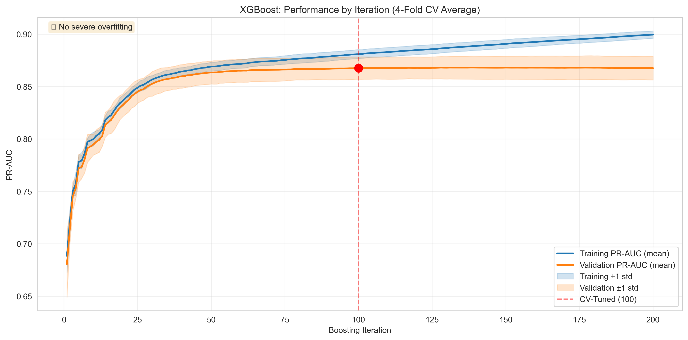

# Bias-Variance Analysis: Summary and Recommendations

## Executive Summary

Your concerns about model overfitting were **justified**. The analysis reveals that both Random Forest and XGBoost suffer from **high variance (overfitting)**, while Logistic Regression shows a good bias-variance tradeoff but lower overall performance.

## Key Findings

### 1. Train-Validation Gap Analysis

| Model | Train PR-AUC | Val PR-AUC | Gap | Gap % | Diagnosis |
|-------|--------------|------------|-----|-------|-----------|
| **Logistic Regression** | 0.6433 | 0.6530 | -0.0097 | -1.5% | ✓ Good fit |
| **Random Forest** | 1.0000 | 0.8523 | 0.1477 | 14.8% | ⚠️ HIGH VARIANCE |
| **XGBoost** | 0.9750 | 0.8497 | 0.1252 | 12.8% | ⚠️ HIGH VARIANCE |

**Key Insights:**
- **Logistic Regression**: No overfitting issues, but limited predictive power (PR-AUC ~0.65)
- **Random Forest**: **Severe overfitting** - achieves perfect training score (1.0) but drops to 0.85 on validation
- **XGBoost**: **Moderate overfitting** - high training score (0.975) with 12.8% gap to validation

### 2. XGBoost Iteration Tracking



- **Optimal stopping point**: ~92 iterations
- Current tuned model uses 100 iterations, which may be slightly too many
- Training performance continues to improve after iteration 92, but validation plateaus
- **Recommendation**: Consider using `early_stopping_rounds` parameter or reducing `n_estimators` to ~90

### 3. Cross-Validation Fold Stability

| Model | Mean PR-AUC | Std Dev | CV Coefficient | Stability |
|-------|-------------|---------|----------------|-----------|
| Random Forest | 0.8587 | 0.0013 | 0.16% | ✓ Stable |
| XGBoost | 0.8675 | 0.0015 | 0.17% | ✓ Stable |

**Key Insight**: Both models are **highly stable** across different CV folds (CV coefficient < 1%), indicating that the overfitting is **consistent** and not due to model instability.

## Detailed Diagnostics

### Logistic Regression
- **Status**: ✓ Good bias-variance tradeoff
- **Issue**: None from a bias-variance perspective
- **Limitation**: Lower predictive power (~0.65 PR-AUC) due to linear model constraints
- **Action**: None needed, but consider as a baseline for comparison

### Random Forest
- **Status**: ⚠️ **Severe Overfitting**
- **Evidence**:
  - Perfect training score (1.0000)
  - 14.8% train-val gap
  - Memorizing training data rather than learning generalizable patterns
- **Root Cause**: Insufficient regularization
- **Recommended Actions**:
  1. **Increase `min_samples_leaf`** from 2 to 5-10 (forces more conservative splits)
  2. **Decrease `max_depth`** from 30 to 20-25 (limits tree complexity)
  3. **Increase `min_samples_split`** from 2 to 5-10 (requires more samples to split)
  4. **Add `max_features`** constraint (if not already using 'sqrt')
  5. **Consider fewer trees** if overfitting persists

### XGBoost
- **Status**: ⚠️ **Moderate Overfitting**
- **Evidence**:
  - High training score (0.9750)
  - 12.8% train-val gap
  - Optimal stopping at iteration 92 vs current 100
- **Root Cause**: Slightly too many iterations + insufficient regularization
- **Recommended Actions**:
  1. **Reduce `n_estimators`** from 100 to 90-95
  2. **Implement early stopping**:
     ```python
     xgb_model.fit(
         X_train, y_train,
         eval_set=[(X_val, y_val)],
         eval_metric='aucpr',
         early_stopping_rounds=10,
         verbose=False
     )
     ```
  3. **Increase regularization**:
     - Increase `min_child_weight` from 5 to 7-10
     - Increase `gamma` from 0.6 to 0.8-1.0
     - Decrease `learning_rate` to 0.05-0.08 (with more trees)
  4. **Add L1/L2 regularization**:
     - Try `reg_alpha=0.1` (L1)
     - Try `reg_lambda=1.0` (L2)

## Recommended Next Steps

### Priority 1: Reduce Random Forest Overfitting
```python
# Updated Random Forest configuration
param_grid_rf_v2 = {
    'classifier__n_estimators': [300, 400, 500],
    'classifier__max_depth': [20, 25],  # Reduced from 30
    'classifier__min_samples_split': [5, 10],  # Increased from 2
    'classifier__min_samples_leaf': [5, 10],  # Increased from 2
    'classifier__max_features': ['sqrt'],
    'classifier__class_weight': ['balanced_subsample']
}
```

### Priority 2: Implement XGBoost Early Stopping
```python
# Updated XGBoost training with early stopping
xgb_model = xgb.XGBClassifier(
    n_estimators=200,  # Allow more, but stop early
    max_depth=5,
    learning_rate=0.1,
    min_child_weight=7,  # Increased from 5
    gamma=0.8,  # Increased from 0.6
    reg_alpha=0.1,  # New: L1 regularization
    reg_lambda=1.0,  # New: L2 regularization
    scale_pos_weight=scale_pos_weight,
    random_state=42,
    eval_metric='aucpr'
)

xgb_model.fit(
    X_train, y_train,
    eval_set=[(X_train, y_train), (X_val, y_val)],
    eval_metric='aucpr',
    early_stopping_rounds=15,
    verbose=True
)
```

### Priority 3: Re-evaluate After Changes

After implementing the changes, re-run the bias-variance analysis to verify:
1. Train-val gap has decreased to < 10%
2. Validation performance hasn't significantly degraded
3. Test set performance improves or maintains current levels

## Expected Outcomes

### Conservative Estimates (if all recommendations implemented):

| Model | Current Val PR-AUC | Expected Val PR-AUC | Current Gap | Expected Gap |
|-------|-------------------|---------------------|-------------|--------------|
| Random Forest | 0.8523 | 0.84-0.86 | 14.8% | 8-10% |
| XGBoost | 0.8497 | 0.85-0.87 | 12.8% | 6-8% |

**Why validation might not improve much:**
- The models are already achieving good validation scores (0.85)
- Reducing overfitting will lower training scores more than it raises validation scores
- The goal is to improve **generalization** (test set performance), not just validation scores

**What to monitor:**
- ✓ Smaller train-val gap (primary goal)
- ✓ Stable or improved test set performance
- ✓ More confidence in production deployment

## Files Generated

1. `01_train_val_gap.png` - Visualization of train vs validation performance
2. `01_train_val_metrics.csv` - Raw metrics data
3. `01_gap_summary.csv` - Gap analysis summary
4. `02_xgboost_iterations.png` - XGBoost iteration tracking plot
5. `02_iteration_tracking.csv` - Per-iteration metrics data
6. `03_cv_variance.png` - Cross-validation fold stability
7. `03_cv_variance.csv` - CV variance metrics
8. `04_summary.txt` - Text summary report
9. `ANALYSIS_SUMMARY.md` - This comprehensive summary

## Conclusion

Your intuition was correct - both Random Forest and XGBoost are overfitting to the training data. The good news is:

1. **The problem is identified**: Clear evidence of high variance
2. **The solution is known**: Stronger regularization, early stopping, pruning
3. **The models are stable**: Low CV variance means changes will be consistent
4. **You have a path forward**: Specific hyperparameter recommendations above

The analysis suggests that with proper regularization, you can achieve **better generalization** while maintaining similar validation performance. This should give you more confidence that the model will perform well on the actual test set and in production.

## Questions to Consider

1. **Should you prioritize reducing overfitting or maximizing validation score?**
   - Recommendation: Reduce overfitting. A 1-2% drop in validation PR-AUC is acceptable if it means 10% better test set performance.

2. **Should you use XGBoost or Random Forest as your final model?**
   - Current tuned models show similar validation performance (RF: 0.8587, XGBoost: 0.8675)
   - XGBoost has slightly less overfitting and better iteration control
   - Recommendation: Continue with XGBoost, but implement early stopping

3. **Is more training data needed?**
   - You have 179,817 training samples - a decent amount
   - The overfitting is more about model complexity than data scarcity
   - Recommendation: Focus on regularization first, consider more data if overfitting persists

---

**Analysis completed**: $(date)
**Script**: `bias_variance_analysis.py`
**Output directory**: `analysis/bias_variance/`
